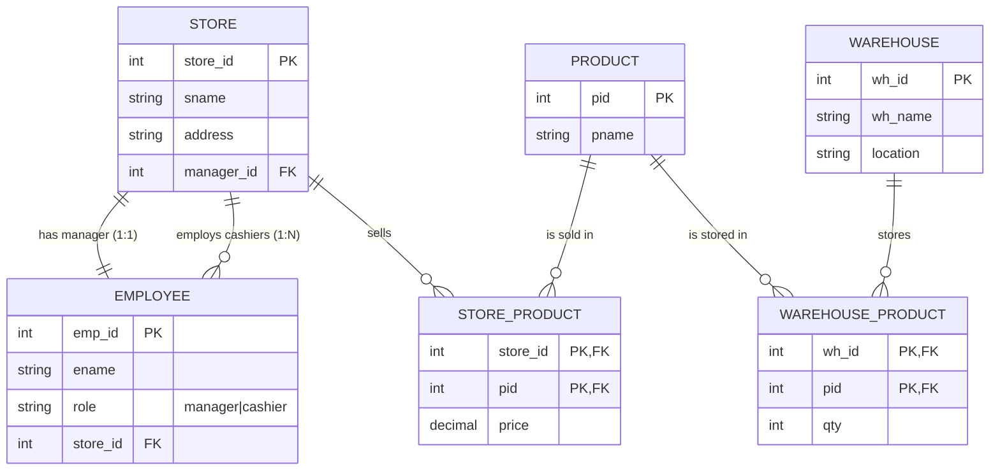

## 1、在网状数据模型和关系数据模型中，各自如何表达两个记录型之间的 m:n 关系？请试用一句话概括关系数据模型与网状数据模型最本质的差别是什么？

网状数据模型：通过"联系记录型(连接记录)+指针链/集合型"把两端记录型连接起来，用指针链接来表示 m:n。
关系数据模型：建立一个关联表(中间关系)，包含两端实体主键作为外键(常组成联合主键)，用多行记录表示 m:n。
本质差别一句话：网状模型用指针显式表示记录间联系并与访问路径耦合；关系模型用表/键值隐式表示联系、以集合运算访问，数据与访问路径相对分离。

---

## 2、已知关系 R、S 如下图所示。

关系 R：

| **1** | **2** | **3** | **4** |
| ----- | ----- | ----- | ----- |
| a₁    | b₁    | c₁    | d₁    |
| a₁    | b₁    | c₂    | d₂    |
| a₁    | b₁    | c₃    | d₃    |
| a₂    | b₂    | c₁    | d₁    |
| a₂    | b₂    | c₂    | d₂    |
| a₃    | b₃    | c₁    | d₁    |

关系 S：

| **3** | **4** |
| ----- | ----- |
| c₁    | d₁    |
| c₂    | d₂    |

试求下列关系代数运算结果：

(1) $\Pi_{3,4}(\sigma_{3=c_1}(R)) - S$

(2) $R \Join_c S$，其中 $c = (R.3 = S.3) \land (R.4 = S.4)$

(3) $R \div S$

**(1) 参考答案：**

先选：σ_{3=c1}(R) = {(a1,b1,c1,d1), (a2,b2,c1,d1), (a3,b3,c1,d1)}
再投影：Π_{3,4}(...) = {(c1,d1)}
做差：{(c1,d1)} − {(c1,d1),(c2,d2)} = ∅
结果(属性3,4)：空关系

**(2) 参考答案：**

这是等值连接(R.3=S.3 且 R.4=S.4)，匹配到S中的(c1,d1)或(c2,d2)的R元组会保留：
结果(列：1,2,R.3,R.4,S.3,S.4)：
(a1,b1,c1,d1,c1,d1)
(a1,b1,c2,d2,c2,d2)
(a2,b2,c1,d1,c1,d1)
(a2,b2,c2,d2,c2,d2)
(a3,b3,c1,d1,c1,d1)

**(3) 参考答案：**

$$R \div S = \{(x_1,x_2)\mid \forall (y_3,y_4)\in S,\ (x_1,x_2,y_3,y_4)\in R\}$$
检查(1,2)：
(a1,b1) 同时对应 (c1,d1) 和 (c2,d2) ✔
(a2,b2) 同时对应 (c1,d1) 和 (c2,d2) ✔
(a3,b3) 缺少 (c2,d2) ✘
结果(属性1,2)：
(a1,b1)
(a2,b2)

---

## 3、假设数据库中有如下三个关系：

```
Sailors(sid, sname, rating, birth, master)
/* 分别为水手的编号、名字、级别、出生日期、师父的编号，
   每个水手的师父也是水手 */

Boats(bid, bname, color)
/* 分别为船的编号、名字、颜色 */

Reserves(sid, bid, day)
/* 分别为订船水手编号、所订船编号、日期 */
```

请写出表达下列查询要求的 SQL 语句（必须用单条 SQL 语句表达）：

(1) 用嵌套查询查询预定了编号大于 103 的红色船的水手姓名；

(2) 查询只有一人预订的蓝色船的名字；

(3) 按照水手编号、姓名、预定次数，查询每个水手预定蓝色船的总次数；

(4) 查询 2017.11.11 预订过船且只预订过这一次船的水手姓名；

(5) 查询预定船只总次数最多的水手的师傅姓名。

**(1) 参考答案：**

```sql
SELECT s.sname
FROM Sailors s
WHERE s.sid IN (
  SELECT r.sid
  FROM Reserves r
  WHERE r.bid IN (
    SELECT b.bid
    FROM Boats b
    WHERE b.color = 'red' AND b.bid > 103
  )
);
```

**(2) 参考答案：**

```sql
SELECT b.bname
FROM Boats b
JOIN Reserves r ON r.bid = b.bid
WHERE b.color = 'blue'
GROUP BY b.bid, b.bname
HAVING COUNT(DISTINCT r.sid) = 1;
```

**(3) 参考答案：**

```sql
SELECT s.sid, s.sname, COUNT(*) AS blue_cnt
FROM Sailors s
JOIN Reserves r ON r.sid = s.sid
JOIN Boats b ON b.bid = r.bid
WHERE b.color = 'blue'
GROUP BY s.sid, s.sname;
```

**(4) 参考答案：**

```sql
SELECT s.sname
FROM Sailors s
WHERE s.sid IN (
  SELECT r.sid
  FROM Reserves r
  WHERE r.day = DATE '2017-11-11'
)
AND s.sid NOT IN (
  SELECT r.sid
  FROM Reserves r
  WHERE r.day <> DATE '2017-11-11'
);
```

**(5) 参考答案：**

```sql
SELECT DISTINCT m.sname
FROM Sailors m
JOIN Sailors s ON s.master = m.sid
WHERE s.sid IN (
  SELECT r.sid
  FROM Reserves r
  GROUP BY r.sid
  HAVING COUNT(*) = (
    SELECT MAX(cnt)
    FROM (
      SELECT COUNT(*) AS cnt
      FROM Reserves
      GROUP BY sid
    ) t
  )
);
```

---

## 4、利用第 3 题所给的关系，试用嵌有 SQL 的 C 语言程序打印一张报表，内容是水手 **"Li"** 没有预订过的船的编号、名字和颜色。

- 只需表明访问数据库及对查询结果进行处理的程序逻辑
- 不需要严格编程

**参考答案：**

```c
/* 嵌入式SQL + C 伪代码：打印水手"Li"没有预订过的船(bid,bname,color) */

EXEC SQL BEGIN DECLARE SECTION;
  char in_name[20] = "Li";
  int  v_bid;
  char v_bname[40];
  char v_color[20];
EXEC SQL END DECLARE SECTION;

EXEC SQL WHENEVER SQLERROR GOTO sql_error;

/* 1) 声明游标：选出Li没订过的船 */
EXEC SQL DECLARE c1 CURSOR FOR
  SELECT b.bid, b.bname, b.color
  FROM Boats b
  WHERE NOT EXISTS (
    SELECT 1
    FROM Reserves r
    JOIN Sailors s ON s.sid = r.sid
    WHERE s.sname = :in_name
      AND r.bid = b.bid
  )
  ORDER BY b.bid;

/* 2) 打开游标并逐行取结果打印 */
EXEC SQL OPEN c1;

printf("Boats NOT reserved by %s:\n", in_name);
printf("%-6s %-20s %-10s\n", "bid", "bname", "color");

for (;;) {
  EXEC SQL FETCH c1 INTO :v_bid, :v_bname, :v_color;
  if (SQLCODE == 100) break; /* no more rows */

  printf("%-6d %-20s %-10s\n", v_bid, v_bname, v_color);
}

EXEC SQL CLOSE c1;
EXEC SQL COMMIT WORK;
return 0;

sql_error:
  EXEC SQL ROLLBACK WORK;
  printf("SQL error: %ld\n", SQLCODE);
  return 1;
```

---

## 5、在关系数据库中：

(1) 为什么关系的主键上一般都建有主索引？

(2) 当符合检索条件的元组数在关系总元组数中所占的比重较大时（> 20%），为什么使用非簇集索引反而不利？

(3) 为什么在此情况下使用簇集索引有利？

**(1) 参考答案：**

主键唯一且经常用于等值查询/连接；在主键上建主索引可保证快速定位记录并维护唯一性约束，同时提高按主键连接与检索的效率。

**(2) 参考答案：**

非簇集索引的叶子通常存放"键值+记录指针(RID)"。命中比例大时会产生大量随机I/O：先读索引再按RID一条条回表取数据，I/O次数接近甚至超过顺序全表扫描，因此反而更慢。

**(3) 参考答案：**

簇集索引使数据记录按索引键的顺序物理聚集存放。命中大量元组时可按页/区间顺序读取，顺序I/O为主、回表代价低（甚至可直接范围扫叶子对应的数据页），因此比非簇集索引更有利。

---

## 6、在采用封锁法的并发控制方法中，有 X 锁、(S, X) 锁、(S, U, X) 锁等多种锁协议，试举例分析和 (S, X) 锁相比，(S, U, X) 锁协议为什么能够进一步提高系统运行的并发度和效率？

**(S,X)锁的问题：** 读-改-写时通常先加S锁读，等要更新再把S升级为X；若多个事务都持有S并都想升级为X，会互相等待产生"升级死锁"，并且升级期间会阻塞更多事务。

**(S,U,X)的改进：** 增加U(更新)锁。规则：U与S兼容，但U与U不兼容；需要更新的事务一开始就申请U锁读，真正写入时再把U升级为X。这样"可能更新"的事务在同一数据项上最多只有一个持U锁者，避免多个S同时升级造成死锁，减少等待与回滚，从而提高并发度与效率。

**例子：**
T1：读A后要改A；T2：读A后也要改A
- 用(S,X)：
  T1: S(A) 读
  T2: S(A) 读  (兼容)
  T1: 升级X(A) 等待T2释放S
  T2: 升级X(A) 等待T1释放S  -> 升级死锁
- 用(S,U,X)：
  T1: U(A) 读 (与S兼容)
  T2: 申请U(A) 被阻塞(因为U与U不兼容)
  T1: 升级X(A) 写 完成释放
  T2: 获得U(A) 读 再升级X(A) 写
  结果：避免升级死锁，减少无谓等待/回滚，整体吞吐更高。

---

## 7、假设某超市公司要设计一个数据库系统来管理该公司的业务信息，其业务管理规则如下：

(1) 该超市公司有若干仓库和若干连锁商店，供应若干商品；

(2) 每个商店有一个经理和若干收银员，每个收银员只在一个商店工作；

(3) 每个商店销售多种商品，每种商品可在不同的商店销售；

(4) 每个仓库可存放多种商品，每种商品也可存放在不同的仓库；

(5) 每种商品有一个商品编号，每个商品编号只有一个商品名称，但不同的商品编号可以有相同的商品名称；每种商品在不同商店可以有多种销售价格。

试按上述规则设计数据库：

(a) 给出集成后的 E-R 模式；

(b) 将其转换为一组关系模式集（各关系的属性自定）；

(c) 指出每个关系模式的主键和外键；

(d) 指出每个关系属于第几范式。

**(a) 参考答案：** 集成后的E-R模式(文字描述)



**(b) 参考答案：** 关系模式集(属性自定，给出一套常见设计)

```
Store(store_id, sname, address, manager_id)
Employee(emp_id, ename, role, store_id)
Product(pid, pname)
Warehouse(wh_id, wh_name, location)

Store_Product(store_id, pid, price)
Warehouse_Product(wh_id, pid, qty)
```

**(c) 参考答案：** 主键/外键

Store:
- PK: store_id
- FK: manager_id -> Employee(emp_id)

Employee:
- PK: emp_id
- FK: store_id -> Store(store_id)
- 约束(业务规则)：role in ('manager','cashier')
  且每个store恰有一个role='manager'；cashier只能隶属一个store(由store_id实现)

Product:
- PK: pid

Warehouse:
- PK: wh_id

Store_Product:
- PK: (store_id, pid)
- FK: store_id -> Store(store_id)
- FK: pid -> Product(pid)

Warehouse_Product:
- PK: (wh_id, pid)
- FK: wh_id -> Warehouse(wh_id)
- FK: pid -> Product(pid)

**(d) 参考答案：** 各关系所属范式(在上述设计与常规约束下)

Store：3NF(主属性store_id；其他属性完全函数依赖store_id；manager_id亦依赖store_id)
Employee：3NF(主属性emp_id；ename/role/store_id依赖emp_id)
Product：3NF(主属性pid；pname依赖pid；允许不同pid同名不违背范式)
Warehouse：3NF
Store_Product：BCNF/3NF(候选键只有(store_id,pid)，price完全依赖该键)
Warehouse_Product：BCNF/3NF(候选键只有(wh_id,pid)，qty完全依赖该键)

---

## 8、假设规定每个水手最多收两名徒弟。编写一个触发器，监视第 3 题 Sailors 表上的 INSERT 操作，对添加的每条记录判断其师傅水手是否满足该约束（如果有师傅水手），若不满足约束，执行回滚操作。

**参考答案：**

```sql
CREATE OR REPLACE TRIGGER trg_sailors_master_limit
BEFORE INSERT ON Sailors
FOR EACH ROW
DECLARE
  v_cnt NUMBER;
BEGIN
  -- 如果新水手没有师傅则不检查
  IF :NEW.master IS NULL THEN
    RETURN;
  END IF;

  -- 计算该师傅当前徒弟数（不含本条，因为是BEFORE INSERT）
  SELECT COUNT(*)
    INTO v_cnt
    FROM Sailors
   WHERE master = :NEW.master;

  -- 若已有2个徒弟，则插入后会超过2，拒绝
  IF v_cnt >= 2 THEN
    RAISE_APPLICATION_ERROR(-20001, 'Each sailor can have at most 2 apprentices.');
  END IF;
END;
/
```
