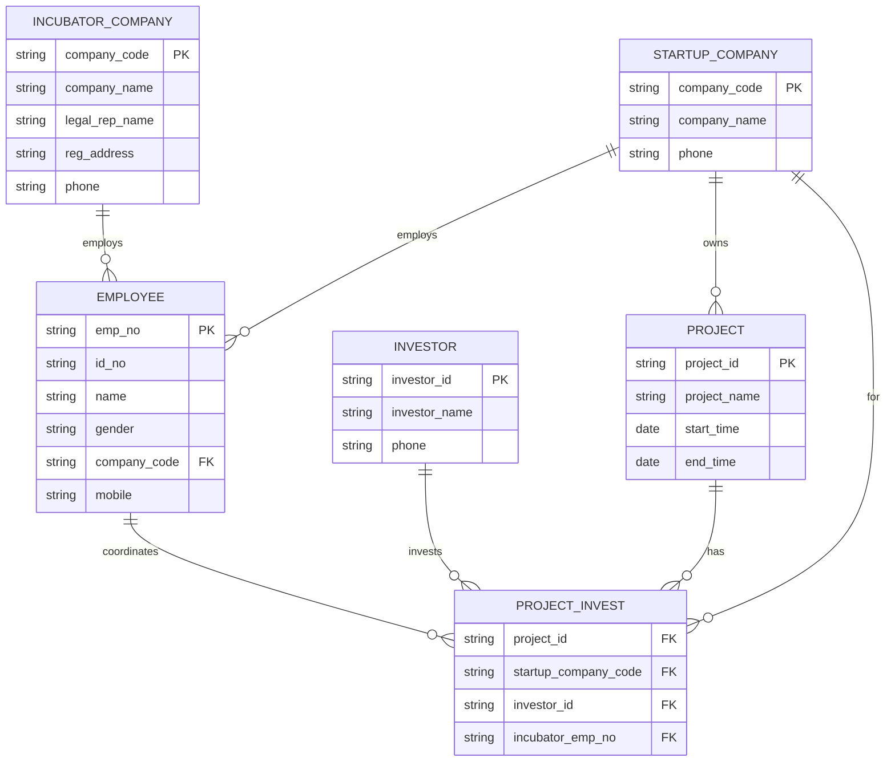

#### 1.

**在 DBMS 中，通常采用多级数据模式，例如概念模式、外模式和内模式，简述数据库系统中的多级数据模式对数据独立性的影响。**

数据库系统的多级数据模式（即三级模式结构：外模式、模式、内模式）通过在这些模式之间提供的**二级映象**（外模式/模式映象、模式/内模式映象），从而保证了数据具有较高的**数据独立性**。

具体影响体现在以下两个方面：

1. **物理独立性（由“模式/内模式映象”保证）：** 当数据库的**存储结构**（内模式）发生改变时（例如更换存储介质、改变存储方式），数据库管理员只需要修改**模式/内模式映象**，而使模式（概念模式）保持不变，从而应用程序也不需要改变。这保证了数据与程序的物理独立性。
    
2. **逻辑独立性（由“外模式/模式映象”保证）：** 当数据库的**逻辑结构**（模式）发生改变时（例如增加新的数据类型、改变数据间的联系），数据库管理员只需要修改**外模式/模式映象**，而使外模式保持不变，从而应用程序也不需要改变。这保证了数据与程序的逻辑独立性。
    

#### 2.
某创业孵化基地管理若干孵化公司和创业公司。为规范管理创业项目投融资业务，需要开发一个信息系统。请根据下述需求描述完成该系统的数据库设计。具体需求如下：  
    （1）需要记录孵化公司和创业公司的信息。孵化公司信息包括：公司代码、公司名称、法人代表名称、注册地址、电话；创业公司信息包括：公司代码、公司名称、电话。孵化公司和创业公司的公司代码编码互不重复。  
    （2）统一管理员工信息。员工信息包括：工号、身份证号、姓名、性别、所属公司代码、手机号；工号唯一标识每位员工。  
    （3）记录投资方信息。投资方信息包括：投资方编号、投资方名称、电话。  
    （4）投资方与创业公司之间依托孵化公司牵线建立创业项目合作关系。具体实施由孵化公司的一位员工负责协调投资方与创业公司的一个创业项目（一个员工只能协调一个创业项目）。一个创业项目只属于一个创业公司，但可以接受若干投资方投资。创业项目相关信息涉及：项目编号、创业公司代码、投资方编号、孵化公司员工工号。

问题（1）：概念数据库设计  
根据需求阶段收集的信息，补全给定的 E-R 图（见第二页）。
问题（2）：根据概念模型得到如下关系模式：  
孵化公司（公司代码，公司名称，法人代表名称，注册地址，电话）  
创业公司（公司代码，公司名称，电话）  
员工（工号，身份证号，姓名，性别，公司代码，手机号）  
投资方（投资方编号，投资方名称，电话）  
项目（项目编号，项目名称，开始时间，完成时间）  
项目投资（项目编号，创业公司代码，投资方编号，孵化公司员工工号）  
要求：给出上述各表的主键和外键。




（2）主键/外键

**孵化公司**
- PK：公司代码
    
- FK：无
    
**创业公司**
- PK：公司代码
    
- FK：无
    
**员工**
- PK：工号
    
- FK：公司代码 →（逻辑上指向所属公司；实现上推荐做一个“公司”总表再 FK 到总表）
    
**投资方**
- PK：投资方编号
    
- FK：无
    
**项目**
- PK：项目编号
    
- FK：无（按题面给的项目表字段就是这样）
    
**项目投资**
- PK（推荐）：(项目编号, 投资方编号)
    
- FK：
    
    - 项目编号 → 项目(项目编号)
        
    - 创业公司代码 → 创业公司(公司代码)
        
    - 投资方编号 → 投资方(投资方编号)
        
    - 孵化公司员工工号 → 员工(工号)

#### 3. 
**基于上一题的数据模式关系，完成下述查询语句 (用 1 条 SQL 语句完成):**

(1) 查询编号“FD02”号投资方所投资所有公司的名称。（6 分）

(2) 查询员工“李小明”负责协调的所有项目的名称、及其创业公司名称和投资方名称。（8 分）

(3) 查询接受唯一投资方投资的项目编号和项目名称。（8 分）

(4) 查询近五年来，投资创业公司项目最多的投资方名称及其投资的项目数。（8 分）

**注：** 关系模式中，开始时间和完成时间为日期型，`getYear()`用于获取年份，`getMonth()`用于获取月份。


(1) 查询编号“FD02”号投资方所投资所有公司的名称。

```sql
SELECT DISTINCT 创业公司.公司名称
FROM 创业公司
JOIN 项目投资 ON 创业公司.公司代码 = 项目投资.创业公司代码
WHERE 项目投资.投资方编号 = 'FD02';
```

_(解析：需要对结果使用 `DISTINCT` 去重，因为同一个投资方可能投资了同一家公司的多个项目。)_

(2) 查询员工“李小明”负责协调的所有项目的名称、及其创业公司名称和投资方名称。

```sql
SELECT 项目.项目名称, 创业公司.公司名称, 投资方.投资方名称
FROM 员工
JOIN 项目投资 ON 员工.工号 = 项目投资.孵化公司员工工号
JOIN 项目 ON 项目投资.项目编号 = 项目.项目编号
JOIN 创业公司 ON 项目投资.创业公司代码 = 创业公司.公司代码
JOIN 投资方 ON 项目投资.投资方编号 = 投资方.投资方编号
WHERE 员工.姓名 = '李小明';
```

 (3) 查询接受唯一投资方投资的项目编号和项目名称。

```sql
SELECT 项目编号, 项目名称
FROM 项目
WHERE 项目编号 IN (
    SELECT 项目编号
    FROM 项目投资
    GROUP BY 项目编号
    HAVING COUNT(投资方编号) = 1
);
```

(4) 查询近五年来，投资创业公司项目最多的投资方名称及其投资的项目数。

```sql
SELECT 投资方.投资方名称, COUNT(项目投资.项目编号) AS 投资项目数
FROM 投资方
JOIN 项目投资 ON 投资方.投资方编号 = 项目投资.投资方编号
JOIN 项目 ON 项目投资.项目编号 = 项目.项目编号
WHERE (getYear(NOW()) - getYear(项目.开始时间)) <= 5
GROUP BY 投资方.投资方编号, 投资方.投资方名称
ORDER BY 投资项目数 DESC
LIMIT 1;
```


#### 4. 
**稠密索引是否一定能够提高针对索引属性查询的效率？为什么？**

**不一定。**
**原因如下：**
1. **查询涉及的数据量过大（选择率低）：** 如果一个查询需要检索表中大量的数据记录（例如，查询结果占全表记录的比例很高，如超过 15%-20%），使用稠密索引（特别是作为辅助索引/非聚簇索引时）可能会导致大量的**随机磁盘 I/O**。系统需要根据索引中的指针一条一条地去磁盘的不同位置读取数据记录。 相比之下，直接进行**全表扫描**（Sequential Scan）使用的是**顺序 I/O**，读取速度要快得多。在这种情况下，使用索引反而比不使用索引更慢。
    
2. **表的数据量很小：** 对于非常小的表，索引带来的查找开销（读取索引页的时间）可能超过直接扫描整个表的时间。在这种情况下，全表扫描往往更高效。


#### 5. 
假设运行记录与数据库的存储磁盘有独立失效模式，介质失效恢复时，对运行记录中上一检查点以前的已提交事务应该 redo 否？为什么？运行记录何时可以清空？

**1. 应该 redo 否？** **应该 Redo（是）。**

**2. 为什么？** 因为题目指定的是**介质失效**（Media Failure，如磁盘损坏），这意味着存储在磁盘上的数据库物理数据已经丢失或损坏。

- 介质失效的恢复通常需要重装数据库的**后备副本（Backup/Dump）**。这个后备副本的时间点通常远早于“上一检查点”。
    
- 虽然“检查点”（Checkpoint）机制保证了在检查点时刻，数据的修改已经写入到了（现已损坏的）磁盘中，但由于磁盘本身发生了故障，这些数据已经丢失。
    
- 当恢复了旧的后备副本后，数据库的状态回到了备份时的状态。为了将数据库恢复到故障前的最新一致状态，必须利用运行记录（日志），**重做（Redo）自后备副本制作以来所有已提交的事务**。这其中必然包含“上一检查点”以前提交的事务。
    
_(注：如果是“系统故障/软故障”恢复，则上一检查点前的已提交事务不需要 Redo，但介质故障必须 Redo。)_

**3. 运行记录何时可以清空？** 运行记录（日志）通常在完成**数据库转储（备份/Dump）** 后才可以清空。

- 原因：日志文件是恢复介质故障的关键。在新的数据库备份生成之前，旧的日志文件记录了从上一次备份到当前的所有变更。如果删除了日志，一旦发生介质故障，就无法从旧备份恢复到最新状态。只有生成了新的备份，之前的日志才失去保留价值，可以被清空或覆盖。


#### 6.
**假设有两项业务对应的事务 T1、T2 与存款关系有关：** 转账业务——T1(A,B,s), 从账户 A 向账户 B 转 s 元； 计息业务——T2, 对当前所有账户计算利息（即原金额为 $X$ 元，计息后为 $X*1.1$）。 上述两个事务的一个并发调度如下表所示：


**(1) 若两个事务的操作遵循 (S,X) 锁，初始时 A=100, B=40, S=10，最终 A,B 结果如何？该并发调度正确与否，为什么？

**(2) 若两个事务的操作遵循 (S,U,X) 锁（相容矩阵如下），初始时 A=100, B=40, S=10，最终 A,B 结果如何？该并发调度正确与否，为什么？

| **T1(A,B,s)** | **T2**   |
| ------------- | -------- |
| Read(A)       |          |
| A:=A-s        | Read(A)  |
| Write(A)      | A:=A*1.1 |
|               | Write(A) |
| ...           | ...      |
|               | Read(B)  |
| Read(B)       | B:=B*1.1 |
| B:=B+s        | Write(B) |
| Write(B)      |          |

|              | **锁申请** |       |       |
| ------------ | ---------- | ----- | ----- |
| **已拥有锁** |            | **S** | **X** |
|              | **S**      | Y     | N     |
|              | **X**      | N     | N     |

|              | **锁申请** |       |       |       |
| ------------ | ---------- | ----- | ----- | ----- |
| **已拥有锁** |            | **S** | **U** | **X** |
|              | **S**      | Y     | Y     | N     |
|              | **U**      | Y     | N     | N     |
|              | **X**      | N     | N     | N     |

 (1) 基于 (S,X) 锁的情况

- **最终 A,B 结果：** **死锁 (Deadlock)**，事务无法完成（或者由系统回滚其中一个事务）。
    
- **该并发调度正确与否，为什么？**
    
    - **不正确（或无法执行）**。
        
    - **原因**：在使用 (S,X) 锁协议（即读加 S 锁，写加 X 锁）时，T1 读取 A 时加了 **S 锁**，T2 读取 A 时也加了 **S 锁**（S 锁互相兼容）。
        
    - 接着，T1 试图写 A，需要将 S 锁升级为 **X 锁**，但必须等待 T2 释放 S 锁；同时，T2 也试图写 A，需要将 S 锁升级为 **X 锁**，必须等待 T1 释放 S 锁。
        
    - 双方都在等待对方释放锁，从而构成了**死锁**。
        

 (2) 基于 (S,U,X) 锁的情况

- **最终 A,B 结果：** **A = 99, B = 55**。
    
- **该并发调度正确与否，为什么？**
    
    - **正确**。
        
    - **原因**：在使用 (S,U,X) 锁协议（更新锁 U）时，事务在读取数据并准备更新时，会先申请 **U 锁**。
        
    - 根据相容矩阵，U 锁与 U 锁是不相容的。因此，当 T1 申请了 A 的 U 锁后，T2 再申请 A 的 U 锁时会被**阻塞（Wait）**。
        
    - 这使得 T2 必须等待 T1 完成对 A（以及后续 B）的操作并释放锁之后才能执行。
        
    - 实际执行顺序变为串行执行：**T1 先执行完毕，T2 再执行**。
        
    - **计算过程**（T1 -> T2）：
        
        - **T1 (转账)**：A = 100 - 10 = 90； B = 40 + 10 = 50。
            
        - **T2 (计息)**：A = 90 * 1.1 = 99； B = 50 * 1.1 = 55。
            
    - 结果符合逻辑，保证了数据的一致性。


#### 7.
在项目投资表上创建触发器，监控 insert 操作，若插入记录的投资方已投资项目中有超过 5 个项目未完成，不允许进行该项投资。

解题思路：
1. **触发时机**：题目要求监控 `INSERT` 操作，因此需要创建一个 `FOR INSERT` (或 `AFTER INSERT`) 触发器。
    
2. **检查逻辑**：
    
    - 获取当前插入记录的 `投资方编号`。
        
    - 联合 `项目投资` 表和 `项目` 表，统计该投资方名下且 `完成时间` 为空（代表未完成）的项目数量。
        
    - **注意**：在 SQL Server 等常见数据库的 `FOR INSERT` 触发器执行时，新记录已经临时存在于表中。如果我们要限制“未完成项目不能超过5个”，意味着插入新记录后，总数如果大于 5（即变成了 6 个），就应该阻止。
        
3. **处理动作**：如果满足禁止条件（未完成项目数 > 5），则执行 `ROLLBACK TRANSACTION` 回滚事务，并提示错误。

```sql
CREATE TRIGGER trg_CheckInvestmentLimit
ON 项目投资
FOR INSERT
AS
BEGIN
    -- 声明变量
    DECLARE @InvestorID VARCHAR(20);
    DECLARE @UnfinishedCount INT;

    -- 1. 从 inserted 临时表中获取当前插入的投资方编号
    -- (注意：若一次插入多行，需用游标或关联查询处理，此处假定单行插入逻辑)
    SELECT @InvestorID = 投资方编号 FROM inserted;

    -- 2. 统计该投资方已投资且未完成的项目总数
    -- 假设：在“项目”表中，字段“完成时间”为 NULL 表示项目未完成
    -- FOR INSERT 触发器执行时，新记录已被计入表中，所以此处 COUNT(*) 包含当前新插的这一条
    SELECT @UnfinishedCount = COUNT(*)
    FROM 项目投资 pi
    JOIN 项目 p ON pi.项目编号 = p.项目编号
    WHERE pi.投资方编号 = @InvestorID
      AND p.完成时间 IS NULL;

    -- 3. 判断逻辑
    -- 题目要求：“若...有超过 5 个项目未完成...不允许”
    -- 如果统计结果 > 5 (例如变成了 6)，说明违反了规则
    IF @UnfinishedCount > 5
    BEGIN
        -- 回滚事务，撤销插入操作
        ROLLBACK TRANSACTION;
        -- 抛出错误提示
        RAISERROR ('该投资方已有超过 5 个未完成项目，不允许进行该项投资。', 16, 1);
    END
END;
```

