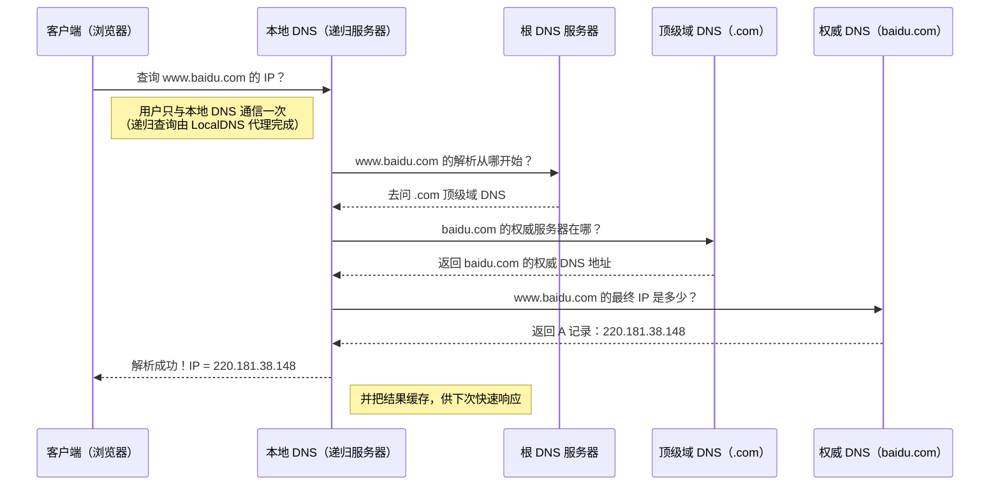

# CH 2
## **一、应用层协议**

### **1. 应用层协议【定义】**

应用层协议定义 **网络中不同主机上的应用进程如何进行通信**，包括：

- 交换哪些报文（请求/响应）
- 报文格式（字段、语法）
- 报文语义（字段的含义）
- 报文顺序（时序）

### **2. 位置【详细解释】**

- 位于 **五层模型的最上层**，直接面向用户和应用程序。
- 负责实现 **Web、Email、文件传输、DNS、视频流媒体、P2P 等具体应用功能**。
- 通过 **运输层（TCP/UDP）提供的端到端服务** 来完成进程间通信。

### **3. 含义【定义】**

应用层协议规定了**应用程序之间通信的规则集合**，例如 HTTP、SMTP、DNS、FTP 等。

### **4. 网络应用体系结构（C/S、P2P、混合）【详细解释】**

#### **① C/S（Client-Server）结构**

- 客户端发起请求，服务器永久运行并等待请求。
- 服务器通常具有固定 IP，易扩展。

#### **② P2P（Peer-to-Peer）结构**

- 各主机对等，既是客户端也是服务器。
- 可扩展性极强（如 BitTorrent）。
- 无需固定服务器，资源分布式存储。

#### **③ 混合结构**

- 部分操作依赖服务器（如用户登录），数据交换走 P2P。
- 典型例子：微信/QQ 文件传输、BitTorrent Tracker 服务。

### **5. 进程通信（端口、地址）【详细解释】**

网络应用间通信 = **进程与进程之间通信**

进程由以下两部分唯一标识：

1. **IP 地址**：确定主机位置
2. **端口号（Port）**：确定主机中哪个进程通信

常见端口：

- HTTP：80
- HTTPS：443
- FTP：21
- SMTP：25
- DNS：53

运输层使用端口来把数据**交给对应的应用进程**（即"复用/分用"）。

### **6. 网络应用需要的传输服务【定义】**

应用程序对运输层的需求包括：

- **可靠性**（是否要求 TCP）
- **时延敏感性**
- **吞吐量需求**
- **安全性**


## **二、Web 与 HTTP**

### **1. Web 页面【定义】**

Web 页面由若干对象组成，包括：

- HTML 文件
- 图片、音频、视频
- 脚本（CSS、JS）

浏览器通过 **HTTP 协议** 从 Web 服务器获取对象。

### **2. HTTP 协议（80，TCP）【详细解释】**

#### **特点**

- **无状态**（服务器不保存客户端历史）
- **基于 TCP**
- 分为 **请求报文** 与 **响应报文**

#### **常见方法**

- GET：获取资源
- POST：向服务器提交数据
- HEAD：获取报文头
- PUT、DELETE（REST 风格）

### **3. 非持久连接 & 持久连接【详细解释】**

#### **非持久连接（HTTP/1.0）**

- 每请求一个对象就建立一次 TCP 连接
- 成本高，需要重复 3 次握手 & 4 次挥手
- 严重降低页面加载速度

#### **持久连接（HTTP/1.1）**

- 一个 TCP 连接可发送多个对象
- 减少延迟
- 可配合 **管道化（pipelining）** 提高速度

### **4. HTTP 报文【定义】**

#### **请求报文格式：**

```
GET /index.html HTTP/1.1
Host: www.example.com
User-Agent: Mozilla/5.0 ...
Accept: text/html,application/xhtml+xml,*/*;q=0.8
Accept-Language: zh-CN,zh;q=0.9
Accept-Encoding: gzip, deflate, br
Connection: keep-alive
Referer: https://www.example.com/home
Cookie: sessionid=abc123
```


#### **响应报文格式：**

```
HTTP/1.1 200 OK
Date: Tue, 07 Dec 2025 12:00:00 GMT
Server: Apache/2.4.57
Last-Modified: Tue, 07 Dec 2025 08:00:00 GMT
Content-Length: 2048
Content-Type: text/html; charset=UTF-8
Connection: keep-alive
Cache-Control: max-age=3600

<html>...</html>
```


| **字段名**                         | **作用**                 | **详细解释**                                                 | **示例**                                     |
| ---------------------------------- | ------------------------ | ------------------------------------------------------------ | -------------------------------------------- |
| **Connection: close / keep-alive** | 是否保持 TCP 连接        | close：响应后关闭 TCP 连接 → 非持久连接。keep-alive：保持连接，可用于多个请求/响应 → 持久连接（HTTP/1.1 默认持久）。 | Connection: close                            |
| **Date:**                          | 响应报文产生并发送的时间 | 指服务器 *生成并发送该响应报文* 的时间，不是资源本身的创建/修改时间。用于缓存、时间同步等场景。 | Date: Tue, 07 Dec 2025 12:00:00 GMT          |
| **Server:**                        | 标识服务器软件类型       | 类似于请求中的 User-Agent。用于标识响应由哪个 Web 服务器(如 Apache、Nginx)生成。通常包含软件名与版本。 | Server: Apache/2.4.57                        |
| **Content-Length:**                | 响应体大小（字节数）     | 指出实体体（Body）的字节数。客户端据此判断要读取多少数据，持久连接情况下也用它划分报文边界。 | Content-Length: 2048                         |
| **Content-Type:**                  | 实体内容类型（MIME）     | 说明响应体的数据类型，如 HTML、JSON、图片等。**不要依赖文件扩展名，应看此字段**。 | Content-Type: text/html; charset=UTF-8       |
| **Content-Encoding:**              | 压缩方式                 | 若服务器对内容进行了 gzip/deflate 等压缩，则需要此字段以便客户端解压。 | Content-Encoding: gzip                       |
| **Last-Modified:**                 | 资源最后修改时间         | 表示对象（文件/网页）在服务器上的 *真正创建或最后修改时间*。浏览器与代理缓存据此发起 **条件请求**（If-Modified-Since），减少带宽。 | Last-Modified: Tue, 07 Dec 2025 08:00:00 GMT |
| **ETag:**（如果需要）              | 资源的唯一标识           | 服务器为资源生成的“唯一标签”。资源内容变更 → ETag 改变。用于更精准缓存验证。 | ETag: "1f-12345abc"                          |

### **5. Cookie【详细解释】**

Cookie 用于 **在无状态 HTTP 上保持用户状态**：

包含四部分：

1. 浏览器 Cookie 文件
2. 服务器数据库记录
3. HTTP 响应头中的 Set-Cookie
4. HTTP 请求头中的 Cookie 字段

用途：

- 登录状态
- 购物车
- 用户行为跟踪

### **6. Web 缓存（代理 Cache）【详细解释】**

- 缓存服务器可代替源服务器提供内容
- 减轻服务器负载
- 加快用户访问速度
- 减少带宽消耗

### **7. 条件 GET（If-Modified-Since）【详细解释】**

用于验证缓存是否过期：

客户端：

```
GET /a.jpg
If-Modified-Since: 时间戳
```

服务器：

- 未修改 → 返回 **304 Not Modified**
- 已修改 → 返回新文件（200 OK）

### **8. RTT 计算【详细解释】**

HTTP 非持久连接一次文件下载：

1 RTT → 建立 TCP 连接

1 RTT → 发送请求 + 返回第一个字节

→ 加上文件传输时间

总耗时 ≈ **2 RTT + 传输时间**


## **三、E-mail（电子邮件系统）**

### **1. 组成【定义】**

电子邮件系统包含三部分：

- 用户代理（Outlook / Foxmail）
- 邮件服务器
- 邮件传输协议（SMTP、POP3、IMAP）

### **2. SMTP 协议（25，TCP）【详细解释】**

用于 **邮件发送与服务器之间转发**。

特点：

- 基于 TCP（25 端口）
- 推式协议（客户端主动推送给服务器）
- 报文格式基于 7-bit ASCII

SMTP 发送流程：

用户代理 → 发件服务器 → 收件服务器 → 用户代理

### **3. 邮件报文格式【定义】**

邮件由两部分组成：

1. **首部（Header）**：To、From、Subject 等
2. **主体（Body）**：正文内容

```
# 阶段一：连接建立
S: 220 mail.example.com Simple Mail Transfer Service Ready
C: EHLO alice.com
S: 250-mail.example.com
S: 250-SIZE 35882577
S: 250-PIPELINING
S: 250 AUTH LOGIN PLAIN

# 阶段二：邮件传输
C: MAIL FROM:<alice@alice.com>
S: 250 OK
C: RCPT TO:<bob@bob.com>
S: 250 OK
C: DATA
S: 354 End data with <CRLF>.<CRLF>
C: Subject: Test
C: From: alice@alice.com
C: To: bob@bob.com
C:
C: This is a test email.
C: .
S: 250 OK: queued as 12345

# 阶段三：连接释放
C: QUIT
S: 221 Bye
```

### **4. 获取邮件的三种方式【详细解释】**

#### **① POP3（110，TCP）**

- 下载式读取邮件
- 只能看到 inbox
- 状态简单

#### **② IMAP**

- 邮件保存在服务器
- 支持多文件夹、服务器端搜索
- 多端同步

#### **③ WebMail（HTTP）**

- Gmail、Outlook
- 通过 Web 浏览器访问
- 依赖 HTTP/HTTPS，不直接使用 POP3/IMAP


## **四、DNS 域名系统**

### **1. DNS 功能（53，UDP）【定义】**

DNS 实现 **域名 → IP 地址** 的映射，是应用层协议。

### **2. DNS 提供的服务【详细解释】**

1. **主机名解析（最主要）**
2. **邮件服务器定位（MX 记录）**
3. **负载均衡（多 IP 轮询）**

### **3. 实现方式（两种查询）【详细解释】**

#### **① 递归查询**

- 本地 DNS 代表客户端向根域名服务器提问
- 查询压力集中在本地 DNS

#### **② 迭代查询**

- 本地 DNS 依次问：根 → 顶级域 → 权威域
- 每一步服务器返回下一步应询问的地址

实际 DNS 过程一般兼用两者。

### **4. 四类域名服务器【定义】**

1. 根 DNS 服务器
2. 顶级域 DNS（.com、.org、.cn）
3. 权威 DNS（负责某域名的最终信息）
4. 本地 DNS（运营商/校园网提供）


