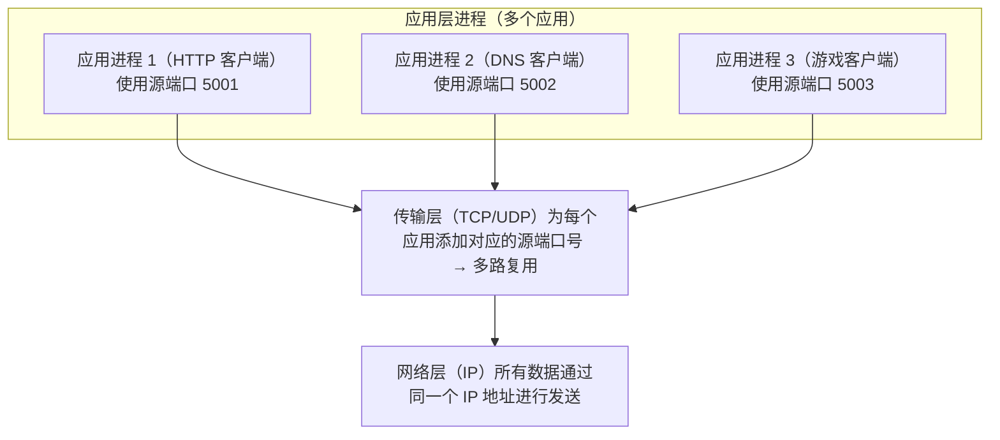
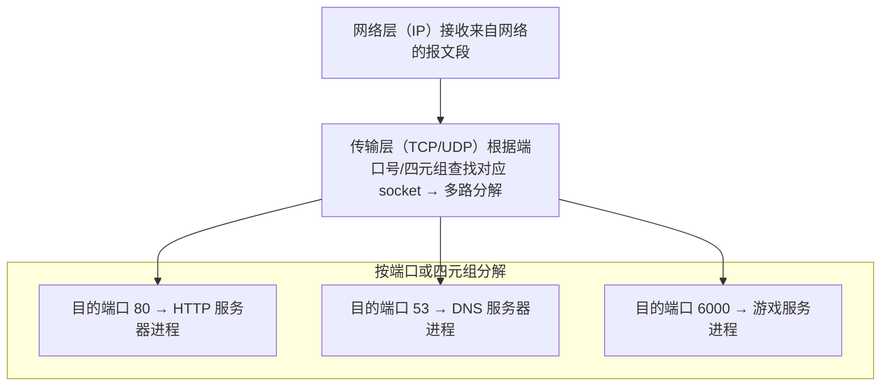
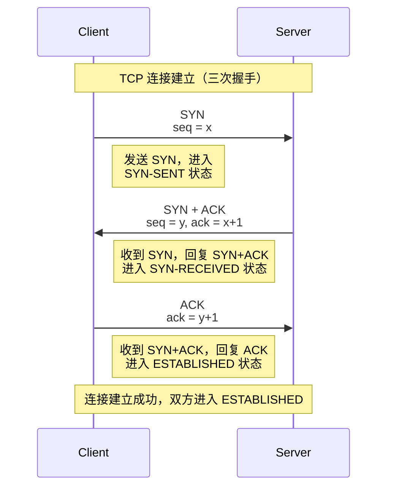
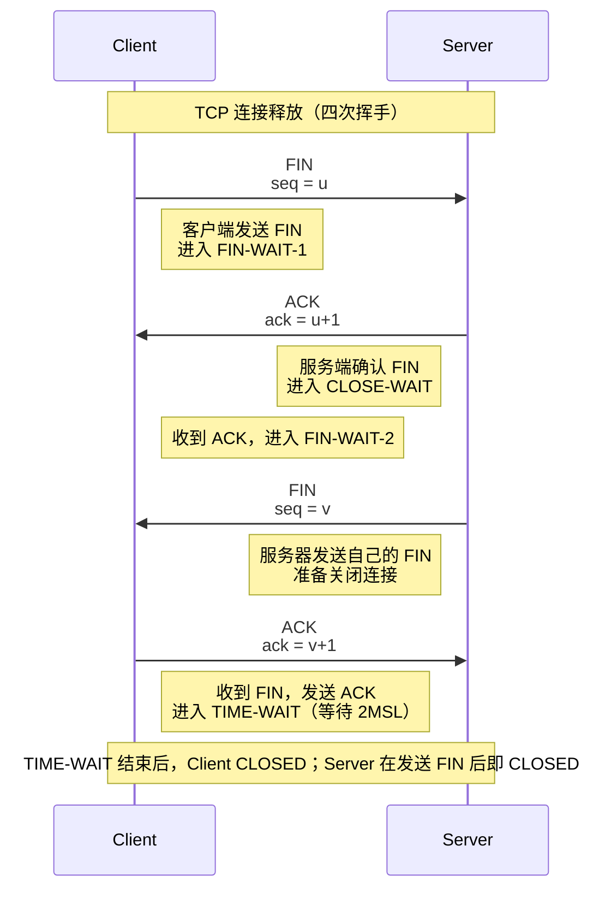

# CH 3
## **一、传输层概述**

### **1. 传输层的功能【详细解释】**

传输层位于 **应用层和网络层之间**，主要提供 **端到端（进程到进程）** 的数据传输服务，关键功能包括：

1. **复用与分解**：
  - 复用：多个应用进程的数据通过同一个网络层连接发送；
  - 分解：接收端把从网络层收到的数据按端口号交给正确的应用进程。

2. **端到端可靠传输（TCP）**：
   - 差错检测、确认（ACK）、重传、序号、定时器、流量控制等。
   
3. **端到端流量控制**：
   - 防止发送方把数据发得过快，淹没接收方缓冲区。
   
4. **拥塞控制（TCP）**：
   - 根据网络拥塞状况调节发送速率，避免过载。
   

### **2. 传输层的位置【定义】**

在五层模型中，自下而上为：

物理层 → 数据链路层 → 网络层 → **传输层** → 应用层。

传输层面向应用层，向应用提供“**端到端**”服务；它调用网络层提供的“**点到点**”服务。

### **3. 传输层数据单元【定义】**

- 传输层的协议数据单元叫 **报文段（segment）**。

  - TCP 报文段
  - UDP 用户数据报
  

### **4. 传输层与网络层的关系【详细解释】**

- **网络层**：负责主机到主机（IP 地址之间）的分组转发和路由。
- **传输层**：在此基础上提供 **进程到进程** 的通信，并可增加可靠性、流量控制、拥塞控制等高级功能。

对应关系可以记成一句话：

> IP 负责“把包送到对方主机”，传输层负责“把数据送到对方正确的进程，而且送对、送全、送顺序”。

## **二、多路复用与多路分解**

### **1. 多路复用（multiplexing）【定义】**

在发送方，多个应用进程产生的数据，通过不同的端口号，**复用** 到一个或少数几个传输层协议（TCP/UDP）上，再交给网络层发送。

### **2. 多路分解（demultiplexing）【定义】**

在接收方，传输层从网络层收到报文段，根据报文段中的 **端口号 等字段**，把数据分交给对应的应用进程。

### **3. TCP 和 UDP 的 socket 唯一标识【详细解释】**

#### **① UDP socket（二元组）**

- 一个 UDP 套接字在接收端由 **（目的 IP 地址，目的端口号）** 唯一标识。
- 多个发送方只要发往同一个（IP, 端口）的 UDP 报文，都会交给同一个套接字。
- UDP 不区分不同发送方的“连接状态”，因此是 **无连接的**。

#### **② TCP socket（四元组）**

一个 TCP 连接由 **四元组** 唯一标识：

> （源 IP，源端口，目的 IP，目的端口）

- 服务器可以用 **同一个监听端口**（比如 80）同时与多个客户端建立不同的 TCP 连接，因为四元组中“源 IP、源端口”不同。
- 这也是 HTTP 服务器能同时服务成千上万用户的关键。

## **三、UDP 协议**

### **1. UDP 的特点：无连接、不可靠【详细解释】**

- **无连接**：发送方在发送数据前不需要建立连接，收到数据后也不用释放连接。

- **不可靠**：
- UDP 尽力而为交付：只负责送给 IP；
  - 不保证数据一定到达、不保证顺序、不重传。

- **优点**：开销小、头部短、时延低，适合 **实时应用**（语音、视频、在线游戏、DNS 查询等）。

### **2. UDP 报文格式【详细解释】**

UDP 头部只有 4 个字段（共 8 字节）：

1. 源端口号（16 bit）
2. 目的端口号（16 bit）
3. 长度（16 bit）：UDP 头 + 数据总长度
4. 校验和（16 bit）

后面紧跟数据部分。

正因为 UDP 头部简单，所以处理开销小，效率高。

### **3. UDP 校验和【详细解释】**

- 作用：进行 **差错检测**，发现比特错误。

- 计算方法：

  - 把 UDP 伪首部 + UDP 头部 + 数据，看作一串 16 位字；
  - 求 **反码和**；
  - 接收端同样求和，如得到全 1，则认为无错，否则丢弃报文。

注意：

- 校验和只能 **检测错误**，不能纠正；
- UDP 只在本层做检测，不做重传。
#### 规则

1. **逐个 16 位相加**（使用 16 位一补加法）
    
    - 即：普通加法得到的结果如果超过 0xFFFF，就把**进位回卷**加到低 16 位上
        
    - 形式：`sum = (sum & 0xFFFF) + (sum >> 16)`（可能需要重复一次，直到无进位）
        
2. 最后得到 `sum` 后，checksum = **~sum**（按位取反）并截断为 16 位

## **四、可靠数据传输机制（rdt）**

### **1. rdt 状态图【详细解释】**

教材通过 rdt 1.0、2.0、2.1、2.2、3.0 等状态机，逐步引出可靠传输要素：

- rdt1.0：假设完全可靠，无差错。
- rdt2.x：引入 **差错检测** 和 **ACK/NAK**。
- rdt3.0：再考虑 **信道丢包**，需要 **超时重传（定时器）**。

核心思想：

> 用 **序号 + 差错检测 + 确认 + 超时重传** 实现可靠传输。

| 版本     | 信道问题             | 主要机制                  | 仍然缺少的东西              |
| ------ | ---------------- | --------------------- | -------------------- |
| rdt1.0 | 无错误、无丢失          | 直接收发                  | 连错误检测都没有             |
| rdt2.0 | 只比特错误（数据包）       | 校验和 + ACK/NAK + 重传    | ACK/NAK 自身出错没处理      |
| rdt2.1 | 比特错误（含 ACK/NAK）  | 加序号，能识别重复包；ACK/NAK    | 协议复杂，还要 NAK          |
| rdt2.2 | 同 2.1            | 只用 ACK（重复 ACK 代替 NAK） | 没有处理“分组丢失”           |
| rdt3.0 | 比特错误 + 分组/ACK 丢失 | 再加定时器和超时重传（停等协议）      | 信道利用率低，需要 pipelining |

### **2. 差错检测【定义】**

利用 **校验和、CRC 等技术**，判断报文在传输过程中是否产生比特错误。

### **3. 应答机制（ACK/NAK）【详细解释】**

- **ACK（Acknowledgement）**：确认帧，表示报文正确收到。
- **NAK（Negative ACK）**：否认帧，表示报文出错，请重传。
- 在实际 TCP 中只用 ACK，不用 NAK，通过 **重复 ACK** 间接表示“某报文可能丢失”。

### **4. 序号【详细解释】**

- 发送方为每个报文段分配一个 **序列号**。

- 接收方用序列号判断报文是否重复、是否按序到达。

- 在停等协议中，序号可只用 0/1 两个值；

  在流水线协议中，需要更大的序号空间。

### **5. 定时器【详细解释】**

- 发送方发送报文后启动定时器：

  - 若在超时时间内收到 ACK → 认为成功；
  - 否则超时 → **重传该报文**。
  
- 超时时间需要估计 RTT，不能太短（误判）也不能太长（恢复慢）。

### **6. 滑动窗口与流水线协议【详细解释】**

#### **① 滑动窗口**

- 发送方维护一个窗口：

  - 窗口内报文可以连续发送而不必等待 ACK；
  - 收到 ACK 后，窗口向前滑动。
  
- 这样可以 **流水线式发送，提高信道利用率**。

#### **② 两类流水线协议**

1. **回退 N 步（Go-Back-N, GBN）**

   - **发送窗口大小为 N**，一次可流水线发送 N 个未确认报文段；
   - **接收窗口大小为 1**：只接受按序到达的下一个报文段，失序报文直接丢弃；
   - **累计确认（ACK）**：接收方只确认“最后一个按序收到的序号”，不对失序报文单独确认；
   - **超时重传策略**：
     - 发送方通常只给**最早未确认的报文段**设置一个定时器；
     - 一旦超时，**从最早未确认开始的所有已发送报文段全部重传**；
   - **适用性**：实现简单、开销低；但在丢包或误码时会产生大量重复重传，浪费带宽。
   
2. **选择重传（Selective Repeat, SR）**

   - **发送窗口大小为 N，接收窗口大小也为 N**：允许一定范围内的失序到达；
   - **逐个确认（ACK）**：接收方对每个正确收到的报文段分别确认；
   - **接收方缓存失序报文**，等缺失报文到达后，再按序交付给应用层；
   - **选择性重传**：发送方仅重传**未被确认**的报文段，避免回退重传；
   - **定时器**：通常为每个未确认报文段维护定时器，超时只重传该报文；
   - **序号空间要求**：为避免新旧报文混淆，序号空间至少满足 `2N`，即 `N ≤ 2^(k-1)`（k 为序号比特数）。
   - **适用性**：重传开销小、效率高；但实现复杂，需要维护接收缓存和窗口管理。
   
   [可视化链接](https://computerscience.unicam.it/marcantoni/reti/applet/)
   
**信道利用率计算** ^439623

信道利用率 $U$ 的定义是：**发送方实际发送数据的时间**占**整个传输周期时间**的比例。

$$ U = \frac{T_{\text{发送数据}}}{T_{\text{总周期}}} $$

**对于停-等协议**，一个完整的周期包括：
1.  发送数据帧的时间 ($T_{\text{data}}$)
2.  数据帧传送到接收方的时间 ($T_{\text{prop}}$)
3.  接收方发送确认帧(ACK)的时间 ($T_{\text{ack}}$)
4.  确认帧传送到发送方的时间 ($T_{\text{prop}}$)

**对于滑动窗口协议**
下面这个“流水线（滑动窗口）协议的利用率公式”

$U=\min\left(1,\ \frac{W\cdot (L/R)}{RTT + (L/R)}\right)$

假设（公式成立的前提）
1. **无丢包、无重传**，ACK 不会丢。
2. **接收方立刻回 ACK**，处理时间忽略。
3. **ACK 很小**，其发送时延忽略（传播时延仍包含在 RTT 里）。
4. RTT 视为常数。
5. 窗口大小 (W) 以“分组个数”计；每个分组长度 (L) bit；链路速率 (R) bit/s。

## **五、TCP 协议**

### **1. TCP 报文格式【详细解释】**

重要字段：

- 源端口号、目的端口号

- 序号 seq：指本报文段第一个字节的序号

- 确认号 ack：期望收到的下一个字节序号（累计确认）

- 首部长度

- 标志位：

  - **SYN**（连接建立），
  - **FIN**（连接释放），
  - **ACK**（确认有效），
  - **RST、PSH、URG** 等
  
- 窗口大小：用于流量控制（接收方通告的 **rwnd**）

- 校验和、紧急指针、选项（最大报文段长度 MSS 等）

### **2. TCP 工作原理【详细解释】**

TCP 提供 **面向连接的、可靠的、按序的、全双工的字节流服务**：

1. 连接建立后，双方维护：

   - 发送缓存、接收缓存
   - 序号和确认号
   - 定时器和重传机制
   
2. 可靠性实现：

   - 校验和、序号、ACK、超时重传
   - **累计确认 + 快速重传**（三个重复 ACK → 立即重传）
   
3. 有序交付：

   - 接收方对失序数据做缓存，按序交付给应用。

### **3. TCP 流量控制【详细解释】**

- 目标：**防止发送方发送速度过快，溢出接收方缓存**。

- 机制：接收方在每个 TCP 报文中通告 **接收窗口 rwnd**。

  - 实际可发送窗口大小 = min(rwnd, cwnd)（cwnd 是拥塞窗口）。

- 当接收方缓存快满时，可以把 rwnd 调小甚至置 0，让发送方减速甚至暂停发送。

### **4. TCP 连接建立（三次握手）【详细解释】**

1. **SYN**：客户端发送 SYN 报文，进入 SYN-SENT。
2. **SYN+ACK**：服务器收到后发送 SYN+ACK，进入 SYN-RCVD。
3. **ACK**：客户端回复 ACK，双方进入 ESTABLISHED 状态，连接建立完成。

目的：

- 双方交换初始序列号（ISN）；
- 确认双方收发能力都正常，避免“旧连接报文”影响。

### **5. TCP 连接释放（四次挥手）【详细解释】**

1. 主动关闭方发送 FIN，进入 FIN-WAIT-1。
2. 被动方回 ACK，进入 CLOSE-WAIT；主动方进入 FIN-WAIT-2。
3. 被动方处理完数据后发送 FIN，进入 LAST-ACK。
4. 主动方回 ACK，进入 TIME-WAIT，等待 2MSL 后关闭；被动方收到 ACK 后直接 CLOSED。

**TIME-WAIT 的原因**：

- 确保对方收到最后一个 ACK；
- 使得“旧连接中的滞留报文”在网络中自然消失。

## **六、拥塞控制**

### **1. 拥塞的原因与代价【详细解释】**

- **原因**：
- 网络中大量主机同时发送数据，
  - 路由器缓存溢出，链路利用率过高，导致分组排队时间很长甚至被丢弃。

- **代价**：
- 丢包率上升 → 重传增多 → 进一步加重拥塞（恶性循环）；
  - 时延剧增，吞吐反而下降（“倒 U 型曲线”）。

### **2. 拥塞控制方法（端到端、网络辅助）【详细解释】**

#### **① 端到端拥塞控制**

- 网络内部设备不直接告诉主机拥塞信息，
- 端系统仅根据 **丢包、时延变化** 等现象猜测是否拥塞并调整发送速率。
- TCP 属于端到端拥塞控制。

#### **② 网络辅助拥塞控制**

- 路由器直接向端系统反馈拥塞信息，例如：

  - **显式拥塞通知 ECN** 位
  - 明确速率的控制报文（如 ATM ABR）
  
- 端系统根据这些反馈调节自己的发送速率。

### **3. TCP 拥塞控制算法【详细解释】**

TCP 通过维护一个 **拥塞窗口 cwnd** 控制发送速率。

实际窗口大小 = min(cwnd, rwnd)。

#### **（1）加性增、乘性减（AIMD）**

- 在网络没有拥塞迹象时：

  - cwnd **线性增加**（每个 RTT 增加约 1 MSS） → “加性增”。

- 一旦检测到丢包（超时或多个重复 ACK）：

  - cwnd **乘性减小**（通常减半） → “乘性减”。

AIMD 使得 TCP 在共享链路时 **公平** 又能充分利用带宽。

#### **（2）慢启动（Slow Start）**

- 连接开始时，cwnd 初始化为 1 MSS（或小值）；
- 每收到一个 ACK，cwnd 增加 1 MSS，
- 即每个 RTT 后 cwnd **翻倍** → 指数增加。
- 当 cwnd 增长到 **慢启动阈值 ssthresh** 时，改为线性增长（进入拥塞避免）。

慢启动目的：

> 从小速率开始，快速探测可用带宽，但又不至于一开始就把网络压垮。

#### **（3）拥塞避免（Congestion Avoidance）**

- 当 cwnd ≥ ssthresh 时，进入拥塞避免阶段：

  - cwnd 以 **加性增** 方式缓慢线性增长，每个 RTT +1 MSS。

- 若发生拥塞（超时）：

  - ssthresh = cwnd / 2；
  - cwnd 重置为 1 MSS，重新慢启动。
  

#### **（4）快速重传与快速恢复（Fast Retransmit / Fast Recovery）**

**快速重传**：

- 若发送方连续收到 **3 个相同的重复 ACK**，认为某个报文丢失；
- 不等超时，立刻重传该报文段。

**快速恢复**（经典 Reno）：

- 收到 3 个重复 ACK 时：

  - ssthresh = cwnd / 2；
  - cwnd = ssthresh（或 ssthresh + 3MSS）；
  - 进入拥塞避免阶段，而不是回到 1 MSS 慢启动。
  

目的：

> 说明网络仍有一定数据在成功传输，无需把速率降得太狠，从而更快恢复到合理发送速率。
