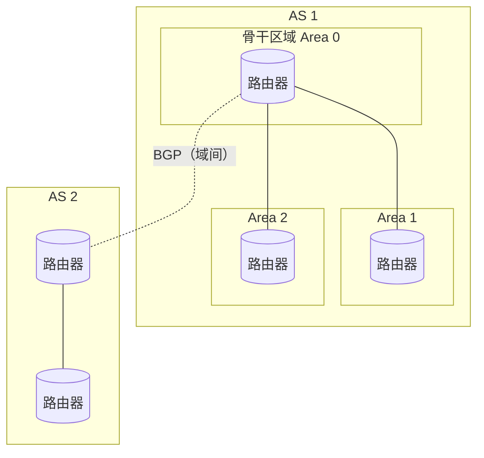

# CH 5
## **一、路由选择算法**

### **1. 链路状态路由（Link-State，LS）【主要思想——详细解释】**

**核心思路：**

1. 每个路由器测量与 **所有邻居链路的代价**（带宽、时延、跳数等）。
2. 周期性或有变化时，把这些信息打包成 **链路状态通告 LSA**，利用 *洪泛（flooding）* 向整个区域所有路由器广播。
3. 这样，每台路由器都获得 **整张网络的拓扑图 + 每条链路代价**。
4. 在本地运行 **Dijkstra 最短路径算法**，计算从自己到所有目的网络的最短路径树 → 得到路由表。

**特点：**

- 每个路由器有 **全网视图**；
- 计算复杂度较高，但**收敛快**；
- 典型代表：**OSPF、IS-IS**。

### **2. LS 算法实例【详细解释（略公式）】**

- 给定一张带权有向图（每个节点=路由器，每条边=链路代价）。

- 假设从节点 A 出发，用 Dijkstra：

  1. 初始化：A 到自身距离 0，其它为 ∞；
  2. 每次选取当前尚未确定、距离最小的节点加入“已确定集合”；
  3. 用它更新邻居的最短距离；
  4. 直到所有节点处理完。
  
- 得到从 A 到每个节点的最小代价及下一跳 → 填入转发表。

考试一般：给一小图，要求写出若干轮 Dijkstra 的中间表。

### **3. 距离矢量路由（Distance-Vector，DV）【主要思想——详细解释】**

**核心思路：**

1. 每个路由器只知道：

   - 自己到 **邻居** 的链路代价；
   - 以及邻居报告来的“**到所有目的网络的距离向量**”。
   
2. 路由器维护一个 **距离向量表**：

   - $D_x(y) = 从本路由器 x 到目的 y 的最小代价估计$。

3. 周期性地或有变化时，向所有邻居发送自己的距离向量；

   - 邻居收到后，用 **Bellman-Ford 迭代式** 更新：

     $D_x(y) = \min_v \{ c(x,v) + D_v(y) \}$

4. 经过多次迭代后，全网距离向量收敛，形成稳定路由。

**特点：**

- 各路由器只需知道邻居，不必获知全网拓扑；
- 计算量小，但**收敛较慢**，存在“无穷计数”等问题；
- 典型代表：**RIP**。

### **4. LS 与 DV 的比较【详细解释】**

| **方面**   | **链路状态 LS**          | **距离矢量 DV**          |
| ---------- | ------------------------ | ------------------------ |
| 需要的信息 | 全网拓扑和链路代价       | 邻居的距离向量           |
| 计算地点   | 本地运行 Dijkstra        | 本地运行 Bellman-Ford    |
| 收敛速度   | 收敛快                   | 收敛慢，可能出问题       |
| 消息开销   | LSA 洪泛；拓扑大时较多   | 周期性小向量，较少       |
| 缺点       | 实现复杂、维护拓扑开销大 | 有“无穷计数”等稳定性问题 |

### **5. LS 路由震荡【详细解释】**

**现象：**

- 链路状态算法中，链路代价往往与链路负载（流量）有关。
- 当某条链路负载变大 → 代价上升 → 路由算法计算出新的路径，部分流量绕路；
- 结果原来的链路负载下降，新路径负载升高 → 又触发代价更新 → 再次改路由……
- 如此反复，称为 **路由震荡（route oscillation）**。

**解决思路：**

- 不让代价对瞬时流量过于敏感（使用平滑平均、阈值）；
- 或保持代价相对稳定，只在链路质量明显变化时更新。

### **6. DV 的无穷计数问题与毒性逆转【详细解释】**

**无穷计数问题：**

- 在 DV 中，链路断开或某条路径变得不可达时，
- 邻居路由器仍可能互相通告对方“还有一条略长的路径”，
- 导致每一次迭代距离值增大 1（或增加固定值），
- 距离不断“向上数”，直到达到预设上限，被认为无限大 → **收敛极慢**。

**毒性逆转（poisoned reverse）：**

- 解决无穷计数的一种技巧：

- 若路由器 x 的最优路径到目的 y 是通过邻居 v，

  那么在发送给 v 的距离向量中，x 把$D_x(y)$人为设置为 **∞（毒化）**；

- 表示“对于目的 y，我不会通过你 v 再走回来了”。

- 这样就避免了 x 与 v 之间形成“两节点互相鼓励”的错误路径，从而减轻无穷计数问题（但对含多跳的环路仍不能完全解决）。

## **二、域内路由协议：OSPF**

### **1. OSPF 的工作原理【详细解释】**

OSPF（Open Shortest Path First）是典型的 **域内链路状态路由协议**：

1. 使用链路状态思想：

   - 每个路由器向所在 **自治系统 AS 内** 的所有路由器 **洪泛 LSA**；
   - 每个路由器构建完整拓扑图，运行 **Dijkstra** 算法求最短路径。
   
2. OSPF 支持 **分层自治系统**：

   - 将一个大型 AS 划分成多个 **区域（area）**；
   - 区域内洪泛受限在本区域，减小开销；
   - 中心有一个 **骨干区域（Area 0）** 连接其他区域。
   
3. OSPF 报文直接封装在 IP 数据报中，协议号 89。

### **2. OSPF 的功能【详细解释】**

- 支持多种 **链路代价度量**（带宽、费用、时延）；
- 支持 **多路径路由**（多条等价最短路径可同时使用）；
- 支持 **安全认证**（更新报文可携带认证信息）；
- 支持不同类型的网络：点到点、广播、非广播多路访问 NBMA 等；
- 在大型 ISP、企业网络中广泛使用。

### **3. 层次路由【详细解释】**

**层次路由（Hierarchical Routing）**：将网络划分为多个层次或区域，在不同层次采用不同的路由策略，以减小路由表规模和路由计算开销。

**为什么需要层次路由？**

- 互联网规模巨大，所有路由器存储全网路由信息不现实；
- 不同的管理机构对路由策略有不同需求；
- 分层可以 **隐藏内部细节、减少消息开销**。

**两层划分：**

#### **① 域内路由（Intra-AS / IGP）**

- 在 **同一个自治系统（AS）内部** 进行路由。
- 典型协议：**RIP、OSPF、IS-IS**。
- 目标：**性能优先**，寻找最优路径。
- OSPF 进一步支持 **区域划分**：
  - 大型 AS 可划分为多个 **区域（Area）**；
  - 区域内路由器只维护本区域的详细拓扑；
  - 所有区域通过 **骨干区域（Area 0）** 互联；
  - 区域边界路由器（ABR）负责区域间路由信息交换。

#### **② 域间路由（Inter-AS / EGP）**

- 在 **不同自治系统之间** 进行路由。
- 典型协议：**BGP**（边界网关协议）。
- 目标：**策略优先**，考虑商业关系、费用、安全等因素。
- 各 AS 通过边界路由器交换 **可达性信息**。

**层次路由结构图：**

## **三、域间路由协议：BGP**

### **1. 域内与域间路由的划分原因【详细解释】**

- 互联网由大量 **自治系统 AS** 组成，每个 AS 由一个或多个管理机构控制（ISP、大学、企业）。

- **域内路由**（intra-AS）：
- 在同一 AS 内进行路由，例如 OSPF、RIP；
  - 目标：**优化性能**（最短路径），拓扑相对稳定且由单一管理实体控制。

- **域间路由**（inter-AS）：
- 不同 AS 之间的路由，需要考虑 **商业关系、策略、可达性** 等。
  - 目标不是单纯“最短”，而是满足各 AS 的 **策略需求**（例如不用竞争对手的网络）。

**因此需要专门的域间路由协议 BGP 来处理跨 AS 的路由选择。**

### **2. BGP 的工作原理与功能（eBGP + iBGP）【详细解释】**

**BGP（Border Gateway Protocol）** 是 Internet 唯一广泛使用的 **域间路由协议**，属于距离向量的“路径向量”扩展。

- 每个 AS 内选出一台或多台 **边界路由器（BGP speaker）**。
- BGP 路由器之间通过 **TCP 连接** 交换路由信息（端口 179）。

**两种 BGP 会话：**

1. **eBGP（external BGP）**
- 不同 AS 之间的 BGP 连接。
   - 用于交换“**可达某些前缀的路径信息**”。

2. **iBGP（internal BGP）**
- 同一 AS 内不同 BGP 路由器之间的连接。
   - 用于在 AS 内传播从外部学到的 BGP 路由。

**功能：**

- 通告：某 AS 可以到达哪些 IP 前缀，以及通过哪个“路径（AS-PATH）”到达。
- 控制：允许 AS 按自己的政策选择接受/转发哪些路由。
- 支撑整个 Internet 的 **可达性和策略路由**。

### **3. BGP 路由选择策略【详细解释】**

当一个 BGP 路由器收到多个到同一前缀的路由时，它按一定 **策略顺序** 选择一个“最佳路由”：

常见判定顺序（简化版本）：

1. **本地优先级（LOCAL_PREF）最大**优先：
   - 由本 AS 配置，体现策略（例如选用“更便宜的运营商”）。
   
2. **AS 路径（AS-PATH）跳数更短**优先：
   - 经过更少自治系统的路径通常更优。
   
3. **下一跳（NEXT-HOP）到达代价更低**优先：
   - 看域内 IGP 度量。
   
4. **其他 tie-breaker**：如 MED、多出口选择、路由器 ID 等。

**重点：BGP 更偏向策略优先而不是单纯最短路**。

## **四、Internet 控制报文协议：ICMP**

### **1. ICMP 的功能【详细解释】**

ICMP（Internet Control Message Protocol）是 IP 层的“**控制/差错报告协议**”，协议号 1，承载在 **IP 数据报**中。

主要功能：

- 报告 **不可达信息**（主机不可达、网络不可达、端口不可达等）；
- 报告 **时间超过**（TTL 归零）；
- 报告 **重定向**（告诉主机以后走更好的路由）；
- 提供 **回显请求/应答**（用于 ping）。

注意：ICMP 并不修复错误，只是通知出错情况，具体如何处理由发送端决定（重传、换路由等）。

### **2. ICMP 的应用：ping【详细解释】**

- ping 使用 **ICMP 回显请求（Echo Request）** 与 **回显应答（Echo Reply）** 报文。

- 典型过程：

  1. 源主机向目的 IP 发送 Echo Request；
  2. 目的主机收到后返回 Echo Reply；
  3. 源主机根据往返时间估算 RTT，并统计丢包率。
  

用途：

- 检测网络是否连通；
- 测试往返时延；
- 判断基本的网络质量。

### **3. ICMP 的应用：traceroute【详细解释】**

- traceroute（Windows 下 tracert）用于 **探测从本机到目的地路径经过的路由器序列**。

基本原理：

1. 发送一系列 UDP（或 ICMP）探测报文，逐次增加 TTL 值：1、2、3……
2. 第一跳路由器把 TTL 减到 0，会丢弃该报文，并向源主机发送 **ICMP “时间超过” 报文**，源主机记录该路由器地址。
3. 依次增加 TTL，直到到达目的主机或达到最大跳数。
4. 这样就得到沿途各路由器 IP 地址及每一跳的 RTT。

## **五、IP 组播**

### **1. IP 组播的概念【详细解释】**

**IP 组播（IP Multicast）**：一种 **一对多** 的通信方式，发送方只需发送一份数据，网络负责将其复制并传送给所有 **组播组成员**。

**三种传输方式对比：**

| **方式** | **发送数量** | **接收者**         | **应用场景**       |
| -------- | ------------ | -------------------- | -------------------- |
| 单播     | 每个接收者一份 | 单个特定主机         | 普通网页访问         |
| 广播     | 一份         | 网络中所有主机       | ARP、DHCP Discover |
| 组播     | 一份         | 加入组播组的所有主机 | 视频会议、IPTV、直播 |

**组播的优点：**

- **节省带宽**：源主机只发送一次，由路由器复制分发；
- **减轻服务器负载**：不必为每个接收者单独发送；
- **适合大规模实时分发**：如网络直播、软件更新分发。

### **2. IP 组播地址【详细解释】**

**IPv4 组播地址范围：**

- **D 类地址**：224.0.0.0 ～ 239.255.255.255
- 前 4 位固定为 `1110`，后 28 位为组播组标识。

**组播地址分类：**

| **地址范围**                  | **用途**                           |
| ----------------------------- | ---------------------------------- |
| 224.0.0.0 ～ 224.0.0.255       | 本地链路组播（TTL=1，不被路由器转发） |
| 224.0.1.0 ～ 224.0.1.255       | 网络协议组播（可跨网络）           |
| 239.0.0.0 ～ 239.255.255.255   | 本地管理组播（类似私有地址）         |
| 其他 D 类地址                  | 全球范围组播                       |

**常见组播地址示例：**

- **224.0.0.1**：本子网所有主机
- **224.0.0.2**：本子网所有路由器
- **224.0.0.5**：OSPF 路由器
- **224.0.0.9**：RIPv2 路由器

**组播组管理协议（IGMP）：**

- 主机通过 **IGMP（Internet Group Management Protocol）** 向路由器报告加入/离开组播组；
- 路由器根据 IGMP 报告维护组播组成员信息，决定是否转发组播数据。
