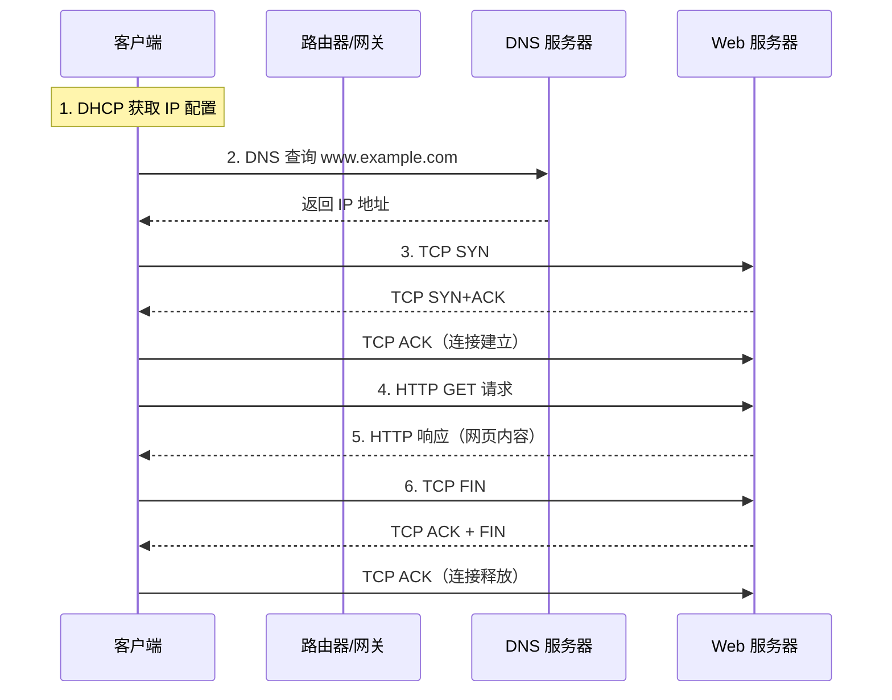

# CH 6
## **一、链路层概述**

### **1. 链路层的功能【详细解释】**

**链路层（Data Link Layer）** 位于网络层之下、物理层之上，主要功能包括：

1. **成帧（Framing）**
   - 将网络层交下来的 IP 数据报封装成 **帧（Frame）**；
   - 添加帧头和帧尾，标识帧的边界。

2. **链路接入（Link Access）**
   - 控制帧在链路上的传输；
   - 在共享介质中，通过 **MAC 协议** 协调多个节点的访问。

3. **可靠交付（Reliable Delivery）**
   - 在某些链路（如无线链路）上提供可靠传输；
   - 通过确认和重传机制保证帧的正确送达。

4. **差错检测与纠正**
   - 检测传输过程中产生的比特错误；
   - 使用校验和、CRC 等技术。

### **2. 链路层的数据单元【定义】**

链路层的协议数据单元称为 **帧（Frame）**。

帧的基本结构：

```
| 帧头（Header） | 数据（网络层数据报） | 帧尾（Trailer） |
```

- **帧头**：包含源/目的 MAC 地址、类型字段等；
- **帧尾**：包含差错检测码（如 CRC）。

### **3. 链路层服务【详细解释】**

链路层向网络层提供的服务：

1. **无确认的无连接服务**
   - 发送帧后不等待确认；
   - 适用于误码率低的可靠链路（如光纤）。

2. **有确认的无连接服务**
   - 每帧发送后需要确认；
   - 适用于误码率较高的链路（如无线链路）。

3. **有确认的面向连接服务**
   - 先建立连接，再传输帧，最后释放连接；
   - 提供流量控制和差错控制。

### **4. 链路层的实现位置【详细解释】**

- 链路层功能主要在 **网络适配器（网卡，NIC）** 中实现；
- 网卡包含：
  - **链路层控制器**：实现成帧、MAC 协议、差错检测等；
  - **物理层接口**：与传输介质相连。
- 软件部分（如驱动程序）运行在主机 CPU 上，负责与操作系统交互。


## **二、差错检测和纠正技术**

### **1. 奇偶校验【详细解释】**

**奇偶校验（Parity Check）**：在数据位后附加一个 **校验位**，使得数据中 1 的个数满足奇偶性要求。

#### **① 一维奇偶校验**

- **偶校验**：使整个数据（含校验位）中 1 的个数为偶数。
- **奇校验**：使整个数据中 1 的个数为奇数。
- 只能检测 **奇数个比特错误**，无法纠错。

#### **② 二维奇偶校验**

- 将数据排列成矩阵，对每行和每列都计算校验位；
- 可以 **检测并定位** 单比特错误，能够纠正。

### **2. 检验和（Checksum）【详细解释】**

- 将数据看作一系列 16 位整数，求和后取反码作为校验和；
- **Internet 校验和**：用于 IP、TCP、UDP 首部校验。
- 计算简单，但检错能力不如 CRC。

### **3. 循环冗余检测（CRC）【详细解释】**

**CRC（Cyclic Redundancy Check）**：基于多项式除法的差错检测技术，广泛用于链路层。

**基本原理：**

1. 发送方和接收方约定一个 **生成多项式 G(x)**，对应一个 (r+1) 位的二进制数；
2. 发送方将数据 D 左移 r 位后，除以 G，得到 r 位余数 R（即 CRC 校验码）；
3. 发送数据后附加 CRC 码；
4. 接收方用收到的帧除以 G，若余数为 0 则无错。

**CRC 计算步骤：**

1. 设数据 D，生成多项式 G 的位数为 (r+1)；
2. 在 D 后附加 r 个 0；
3. 用模 2 除法（异或运算）计算余数；
4. 余数 R 即为 CRC 校验码，附加在数据后发送。

**特点：**

- 能检测所有奇数个错误、所有双比特错误；
- 能检测所有长度小于等于 r 的突发错误；
- 检错能力强，硬件实现简单，广泛应用于以太网、WiFi 等。


## **三、多路访问链路和协议**

### **1. 多路访问的含义【定义】**

**多路访问（Multiple Access）**：多个节点共享同一条广播信道进行通信。

- 问题：多个节点同时发送会产生 **冲突（碰撞）**，导致帧损坏。
- 需要 **多路访问控制协议（MAC 协议）** 来协调各节点的发送。

### **2. 多路访问控制协议类型（3 类）【详细解释】**

#### **① 信道划分协议（Channel Partitioning）**

将信道资源按某种方式划分给各节点，避免冲突：

- **TDMA（时分多址）**：将时间划分为时隙，每个节点分配固定时隙；
- **FDMA（频分多址）**：将频带划分为子频带，每个节点占用一个子频带；
- **CDMA（码分多址）**：每个节点使用不同的编码，可同时发送。

特点：无冲突，但信道利用率可能不高（节点少时浪费资源）。

#### **② 随机访问协议（Random Access）**

节点随机发送，发生冲突后采取措施重传：

- ALOHA、时隙 ALOHA
- CSMA、CSMA/CD、CSMA/CA

特点：实现简单，轻负载时效率高，重负载时冲突多。

#### **③ 轮流协议（Taking-Turns）**

节点轮流获得发送机会：

- **轮询协议（Polling）**：主节点轮询各从节点；
- **令牌传递协议（Token Passing）**：持有令牌的节点才能发送。

特点：无冲突，适合节点数固定的环境。

### **3. ALOHA 协议【详细解释】**

#### **① 纯 ALOHA**

- 节点有数据就立即发送；
- 若发生冲突，等待随机时间后重传；
- **最大信道利用率**：约 **18.4%**。

#### **② 时隙 ALOHA（Slotted ALOHA）**

- 将时间划分为等长时隙，节点只能在时隙开始时发送；
- 减少了冲突的易损期；
- **最大信道利用率**：约 **36.8%**。

### **4. CSMA 协议【详细解释】**

**CSMA（Carrier Sense Multiple Access，载波监听多路访问）**：发送前先监听信道。

- **1-坚持 CSMA**：信道空闲立即发送，忙则持续监听；
- **非坚持 CSMA**：信道忙则等待随机时间后再监听；
- **p-坚持 CSMA**：信道空闲时以概率 p 发送。

问题：由于 **传播时延**，仍可能发生冲突。

### **5. CSMA/CD 的工作原理【详细解释】**

**CSMA/CD（CSMA with Collision Detection，带冲突检测的 CSMA）**：用于 **有线局域网（以太网）**。

**工作流程：**

1. **先听后发**：发送前监听信道是否空闲；
2. **边发边听**：发送过程中继续监测冲突；
3. **冲突检测**：若检测到冲突，立即停止发送；
4. **发送干扰信号**：发送 **JAM 信号**，通知所有节点；
5. **二进制指数退避**：等待随机时间后重传。

**二进制指数退避算法：**

- 第 n 次冲突后，从 {0, 1, 2, ..., 2^n - 1} 中随机选择 k；
- 等待 k 倍争用期后重传；
- n 超过一定次数（如 16 次）后放弃发送。

### **6. 轮流协议【详细解释】**

#### **① 轮询协议（Polling）**

- 存在一个 **主节点**，轮流询问各从节点是否有数据发送；
- 优点：无冲突；
- 缺点：轮询开销、主节点单点故障。

#### **② 令牌传递协议（Token Passing）**

- 节点组成环形结构，**令牌** 在环中循环传递；
- 只有持有令牌的节点才能发送数据；
- 优点：无冲突，适合实时应用；
- 缺点：令牌丢失或节点故障需要恢复机制。


## **四、局域网**

### **1. 局域网的定义和特点【详细解释】**

**局域网（LAN，Local Area Network）**：覆盖 **较小地理范围**（如一栋建筑、一个校园）的计算机网络。

**特点：**

- **范围有限**：通常在几百米到几公里内；
- **高速率**：通常 100 Mbps ~ 10 Gbps；
- **低延迟**：传播距离短；
- **私有性**：通常由单一组织拥有和管理；
- **广播特性**：所有节点共享同一广播域。

### **2. 局域网体系结构【详细解释】**

局域网的链路层分为两个子层：

1. **逻辑链路控制子层（LLC）**
   - 提供与上层的接口；
   - 实现流量控制、差错控制。

2. **媒体访问控制子层（MAC）**
   - 控制对共享介质的访问；
   - 实现帧的封装、地址识别、差错检测。

### **3. 局域网地址（MAC 地址）【详细解释】**

**MAC 地址（Media Access Control Address）**：也称 **物理地址、硬件地址、LAN 地址**。

**表示方式：**

- 长度：**48 位（6 字节）**；
- 表示：用十六进制，如 `1A-2B-3C-4D-5E-6F`；
- 前 24 位：**厂商标识（OUI）**，由 IEEE 分配；
- 后 24 位：**设备标识**，由厂商分配。

**作用：**

- 在 **链路层** 唯一标识一个网络接口；
- 用于 **同一局域网内** 的帧传输；
- **广播地址**：`FF-FF-FF-FF-FF-FF`，表示发送给所有节点。

### **4. ARP 协议【详细解释】**

**ARP（Address Resolution Protocol，地址解析协议）**：将 **IP 地址** 解析为 **MAC 地址**。

#### **① ARP 的功能**

- 在同一局域网内，根据目标 IP 地址获取对应的 MAC 地址；
- 是网络层与链路层之间的桥梁。

#### **② ARP 的工作原理**

1. 主机 A 要向同一子网的主机 B 发送数据，已知 B 的 IP 地址，但不知道 B 的 MAC 地址；
2. A 在局域网内 **广播 ARP 请求**："谁是 IP 地址 x.x.x.x？请告诉我你的 MAC 地址"；
3. 局域网内所有主机收到请求，但只有 B 响应；
4. B 向 A 发送 **ARP 应答**（单播）："我是 x.x.x.x，我的 MAC 地址是 xx-xx-xx-xx-xx-xx"；
5. A 收到应答后，将 IP-MAC 映射存入 **ARP 缓存表**。

#### **③ ARP 表**

- 每台主机维护一个 **ARP 缓存表**；
- 表项格式：`<IP 地址, MAC 地址, TTL>`；
- TTL 通常为 20 分钟，过期后删除；
- 减少重复的 ARP 广播查询。

### **5. 发送数据报到子网以外【详细解释】**

当目标主机 **不在同一子网** 时：

1. 源主机判断目标 IP 不在本子网（通过子网掩码）；
2. 源主机将数据报发送给 **默认网关（路由器）**；
3. 源主机通过 ARP 获取 **网关的 MAC 地址**；
4. 帧的目的 MAC 地址填写 **网关的 MAC 地址**，IP 目的地址仍是最终目标；
5. 路由器收到帧后，解封装得到 IP 数据报，根据路由表转发；
6. 在每一跳，帧的 MAC 地址会改变，但 **IP 地址保持不变**。

**关键理解：**

- **MAC 地址**：用于 **同一链路/局域网内** 的帧传输，逐跳改变；
- **IP 地址**：用于 **端到端** 的路由，全程不变。


## **五、以太网**

### **1. 以太网拓扑结构【详细解释】**

以太网拓扑结构的演变：

- **总线型（早期）**：所有节点连接在一条同轴电缆上，共享介质；
- **星型（现代）**：所有节点通过双绞线连接到 **中心设备（集线器或交换机）**。

现代以太网普遍采用 **星型拓扑 + 交换机**。

### **2. 以太网帧结构【详细解释】**

以太网帧（Ethernet II / DIX 格式）：

| 字段         | 长度     | 说明                               |
| ------------ | -------- | ---------------------------------- |
| 前导码       | 7 字节   | 用于同步（10101010...）            |
| 帧起始定界符 | 1 字节   | 标识帧开始（10101011）             |
| 目的 MAC     | 6 字节   | 目的地址                           |
| 源 MAC       | 6 字节   | 源地址                             |
| 类型         | 2 字节   | 上层协议类型（如 0x0800 表示 IP）  |
| 数据         | 46~1500 字节 | 网络层数据报                   |
| FCS          | 4 字节   | 帧校验序列（CRC-32）               |

### **3. 以太网服务类型【详细解释】**

以太网提供 **无连接、不可靠** 的服务：

- **无连接**：发送帧前不需要建立连接；
- **不可靠**：不提供确认和重传机制。

如果帧出错（CRC 校验失败），直接丢弃，由上层协议（TCP）负责重传。

### **4. 最小帧长度【详细解释】**

以太网规定 **最小帧长度为 64 字节**（不含前导码和帧起始符）。

**原因：**

- 与 **CSMA/CD 冲突检测** 相关；
- 发送端必须在帧完全发出之前能检测到冲突；
- 帧长度必须 ≥ 2 × 传播时延 × 数据速率（即往返时间内能发送的数据量）。

对于 10 Mbps 以太网，最大端到端传播时延约 25.6 μs，往返 51.2 μs：

$$
最小帧长 = 10 Mbps \times 51.2 \mu s = 512 bit = 64 字节
$$

如果数据不足 46 字节，需要 **填充（Padding）** 至 46 字节。

### **5. VLAN（虚拟局域网）【详细解释】**

**VLAN（Virtual LAN）**：在一个物理局域网上划分出多个 **逻辑上独立的广播域**。

**为什么需要 VLAN？**

- 控制广播范围，减少广播风暴；
- 提高安全性，隔离不同部门；
- 灵活组网，无需改变物理连接。

**实现方式：**

- 在交换机上配置端口所属的 VLAN；
- 使用 **802.1Q 标准**，在帧中插入 4 字节的 VLAN 标签；
- 不同 VLAN 之间的通信需要 **路由器**（三层交换）。


## **六、交换机**

### **1. 交换机的位置【定义】**

**交换机（Switch）** 工作在 **链路层（第二层）**，是现代局域网的核心互连设备。

### **2. 交换机的功能【详细解释】**

1. **帧转发**：根据目的 MAC 地址，将帧从输入端口转发到正确的输出端口；
2. **帧过滤**：只向目的端口发送帧，不像集线器那样广播；
3. **隔离冲突域**：每个端口是一个独立的冲突域；
4. **全双工通信**：支持同时收发，无需 CSMA/CD。

### **3. 交换机表（MAC 地址表）【详细解释】**

交换机维护一张 **交换机表（MAC 地址表）**，记录：

- MAC 地址
- 对应的端口号
- 表项的 TTL

#### **① 即插即用**

- 交换机无需手动配置，接入网络即可工作；
- 通过 **自学习** 自动建立转发表。

#### **② 自学习过程**

1. 交换机收到一个帧；
2. 记录 **源 MAC 地址** 与 **进入端口** 的对应关系；
3. 查找 **目的 MAC 地址**：
   - 若找到 → 从对应端口转发；
   - 若未找到 → **泛洪（Flooding）**，从除入口外的所有端口发出；
4. 表项有 TTL，过期自动删除。

### **4. 交换机和路由器的比较【详细解释】**

| **比较项目** | **交换机**           | **路由器**             |
| ------------ | -------------------- | ---------------------- |
| 工作层次     | 链路层（第二层）     | 网络层（第三层）       |
| 转发依据     | MAC 地址             | IP 地址                |
| 广播域       | 不隔-离广播域        | 隔离广播域             |
| 地址表       | MAC 地址表（自学习） | 路由表（路由协议计算） |
| 主要功能     | 局域网内帧转发       | 不同网络之间的分组转发 |
| 配置复杂度   | 即插即用             | 需要配置 IP 地址和路由 |

### **5. 交换机、中继器、集线器的区别【详细解释】**

| **设备**   | **工作层次** | **功能**                                   | **冲突域** | **广播域** |
| ---------- | ------------ | ------------------------------------------ | ---------- | ---------- |
| 中继器     | 物理层       | 信号放大和整形                             | 不隔离     | 不隔离     |
| 集线器     | 物理层       | 多端口中继器，收到信号广播到所有端口       | 不隔离     | 不隔离     |
| 交换机     | 链路层       | 根据 MAC 地址选择端口转发                  | 隔离       | 不隔离     |
| 路由器     | 网络层       | 根据 IP 地址路由转发                       | 隔离       | 隔离       |


## **七、综合示例：Web 页面请求的历程**

### **1. 完整流程【详细解释】**

假设用户在浏览器输入 `www.example.com`，完整的网络交互过程如下：

#### **第一步：获取本机 IP 地址（DHCP）**

1. 主机启动时，广播 **DHCP Discover**；
2. DHCP 服务器回复 **DHCP Offer**，提供 IP 地址、网关、DNS 服务器等；
3. 主机发送 **DHCP Request** 确认使用；
4. 服务器发送 **DHCP ACK**，主机获得 IP 配置。

#### **第二步：域名解析（DNS）**

1. 主机向 **本地 DNS 服务器** 发送 DNS 查询（UDP，端口 53）；
2. 若本地 DNS 无缓存，则迭代查询根 DNS → 顶级域 DNS → 权威 DNS；
3. 最终获得 `www.example.com` 的 IP 地址。

#### **第三步：建立 TCP 连接（三次握手）**

1. 客户端发送 **SYN** 报文段到服务器 80 端口；
2. 服务器回复 **SYN+ACK**；
3. 客户端回复 **ACK**，连接建立。

#### **第四步：发送 HTTP 请求**

1. 客户端发送 **HTTP GET 请求**；
2. 请求封装：HTTP → TCP 报文段 → IP 数据报 → 以太网帧；
3. 需要 ARP 获取网关的 MAC 地址（若不在缓存中）。

#### **第五步：路由转发**

1. 帧到达网关（路由器），解封装得到 IP 数据报；
2. 路由器根据路由表，确定下一跳，重新封装帧；
3. 经过多个路由器转发，最终到达目标服务器。

#### **第六步：服务器处理并响应**

1. 服务器收到请求，处理后发送 **HTTP 响应**；
2. 响应数据沿原路返回客户端。

#### **第七步：释放 TCP 连接（四次挥手）**

1. 传输完成后，双方通过 FIN 和 ACK 报文释放连接。

**整体示意图：**


