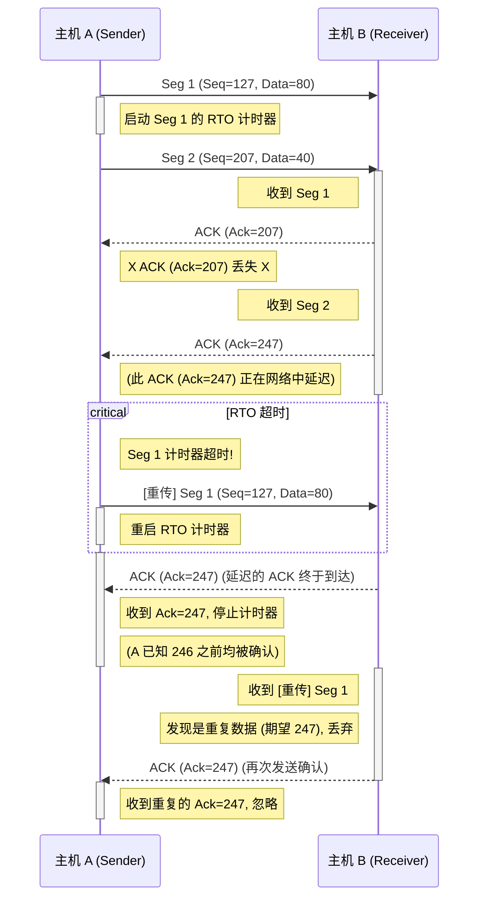

## Chapter 1

#### 1、
请简述电路交换和分组交换的特点，并从多个角度分析两者的优缺点。

电路交换的特点是预留端系统间沿路径通信所需要的资源。

分组交换的特点是输入端使用存储转发传输机制，路由器可以有多条链路进行转发。

电路交换的优点：端到端时延固定，适合于实时服务。

分组交换的优点：有更好的带宽共享，比电路交换更简单更有效。

电路交换的缺点：不考虑需求，而预先分配了传输链路的使用，这使得已分配而不需要的链路时间未被利用。

分组交换的缺点：可能有排队延迟和分组丢失。


#### 2. B

在OSI参考模型中需由应用层的相邻层实现的是(       )

A.会话管理	B.数据格式转换        C.路由选择      D.可靠数据传输

#### 3. C
下列选项中，不属于网络体系结构所描述的内容的是(       ) 
A.网络的层次					    B.每层使用的协议
C.协议的内部实现细节			D.每层必须完成的功能


#### 4. C

下图描述的协议要素是 (       )

I.语法 		II.语义			III.时序

A.仅I		B.仅II		C.仅III		D.I、II和III

![[Pasted image 20260108173213.png]]

#### 5. B

若某分组交换网络及每段链路的带宽如下图所示，则H1到H2的最大吞吐量约为(  )。
A.1Mbps		B.10Mbps		C.100 Mbps 	    D.1000 Mbps
![[Pasted image 20260108173302.png]]


#### 6. 
主机甲通过1个路由器(存储转发方式)与主机乙互联，两段链路的数据传输速率均为10 Mbps。主机甲分别采用报文交换和分组大小为10kb的分组交换向主机乙发送1个大小为8Mb的报文。若忽略链路传播延迟、分组头部开销和分组拆装时间，则两种交换方式完成该报文传输所需的总时间分别是多少？相较于报文交换，分组交换有什么优缺点？


1) 报文交换

整份报文先在第一段链路发完，再由路由器转发到第二段链路：

每段链路发送时间：$8\text{ Mb} / 10\text{ Mb/s} = 0.8\text{ s}$

总时间：$0.8 + 0.8 = 1.6\text{ s}$

2. 分组交换（每分组 10 kb）

分组个数：$N = 8\text{ Mb}/10\text{ kb} = 800$

每个分组在一段链路的发送时间：$t_p = 10\text{ kb}/10\text{ Mb/s} = 0.001\text{ s} = 1\text{ ms}$

两跳存储转发的流水线：第 $k$ 个分组到达主机乙的时间为 $(k+1)t_p$，因此最后一个分组到达时间为 $(N+1)t_p$
 $\Rightarrow (800+1)\times 1\text{ ms} = 801\text{ ms} = 0.801\text{ s}$


#### 7.  
假设使用分组交换网络，要传送的报文长度为 x 比特。从源点到终点共经过 k 段链路，每段链路的数据传输速率为 b 比特/秒，分组长度为 p+h 比特，其中 p 为分组的数据部分长度，h 为每个分组携带的固定长度的控制信息（头部字段）。不考虑节点处理时延、传播时延和排队时延，若使端到端总时延最小，则分组的数据部分长度 p 应该取值多大？


报文长度 $x$，按数据段长 $p$ 分成 $N=\frac{x}{p}$ 个分组。

每个分组经一段链路的发送时间：$\displaystyle t_0=\frac{p+h}{b}$。

存储-转发流水线下，最后一个分组到达终点的时间
$$
T(p)=\bigl(k-1+N\bigr)\,t_0
     =\Bigl(k-1+\frac{x}{p}\Bigr)\frac{p+h}{b}.
$$
只需最小化 $f(p)=\Bigl(k-1+\frac{x}{p}\Bigr)(p+h)$。展开并去常数得
$$
f(p)=(k-1)p+\frac{x\,h}{p}\quad (p>0),
$$
其在 $p>0$ 上是凸的。令导数为 0：
$$
(k-1)-\frac{x\,h}{p^2}=0\;\Rightarrow\; p^{*}=\sqrt{\frac{x\,h}{k-1}}.
$$

> **最后一个分组到达终点的时间** $T(p)=(k-1+N)t_0$

#### 8. A
若下图为一段差分曼彻斯特编码的信号波形，则其编码的二进制位串是(      ) ？
A.1011 1001				B.1101 0001
C.0010 1110				D.10110110

>差分曼彻斯特看虚线部分，有跳变为0，无跳变为1 [[Chapter1#^59ae1b | 编码方式]]

![[Pasted image 20260108173401.png]]


#### 9. D

下列因素中，不会影响信道数据传输率的是（    ）
A. 信噪比	 	B.频率带宽	C.调制速率	D.信号传播速度

- **A. 信噪比（SNR）** ✅
    
    根据信息论中的**香农定理**，信噪比越高，信道容量越大。
    
- **B. 频率带宽** ✅
    
    带宽越大，可承载的符号变化越多，数据传输率越高。
    
- **C. 调制速率** ✅
    
    调制速率（码元速率、符号率）直接影响单位时间内可传输的比特数。
    
- **D. 信号传播速度** ❌
    
    信号传播速度只影响**时延（delay）**，不影响单位时间内能传输多少比特，因此**不影响数据传输率**。

#### 10. 
若某条通信链路的数据传输速率为1Mbps，采用8相位调制，则该链路的波特率是多少？

8 相位调制（8-PSK）每符号携带 $\log_2 8 = 3$ 比特。
 波特率 $R_s = \dfrac{R_b}{\log_2 M} = \dfrac{1\,\text{Mbps}}{3} \approx 3.333\times10^5\,\text{Baud}$。

> 比特率与波特率（符号率）的关系为：$R_b = R_s \times \log_2 M$ [[Chapter1#^1b50fd | 波特率]]


#### 11. 
主机A和B之间通过一条频率带宽为10kHz的链路相连，信噪比为30dB, 该链路实际传输速率约为理论最大值的50%，则该链路的实际传输速率是多少？ 


理论容量：$C = B \log_2(1+\text{SNR})$

$B = 10\,\text{kHz}$，$\text{SNR} = 30\,\text{dB} = 10^{3}=1000$

$C = 10{,}000 \times \log_2(1+1000) \approx 10{,}000 \times 10 \approx 100\,\text{kbps}$

实际速率 $C'=50\,\text{kbps}$

> 参考 [[Chapter1#^9dffec | 香农公式]]


## Chapter 2

### 1. 
相较于C/S模型，请简述P2P模型有什么优缺点？


P2P模型的优势在于其去中心化的特点。网络中没有中央服务器，每个节点既是客户端也是服务端，这使得**资源共享非常高效**。当更多用户加入时，网络的整体服务能力会随之增强，尤其适合分发大型文件。

其缺点也同样源于去中心化。节点可以随时加入和离开，导致**网络连接不稳定**。由于缺乏统一的管理节点，整个网络的维护变得复杂，且在**安全性和可靠性方面难以得到保障**。

### 2. 
Alice使用主机上安装的Foxmail邮件客户端给同学Bob发送了一封邮件，在这一过程中，分别使用了哪些应用层和传输层协议？

**应用层**：

- 从客户端发送邮件至服务器，以及在服务器之间转发邮件，均使用 SMTP 协议。
    
- 用户从服务器上收取邮件时，则会使用 POP3 或 IMAP 协议。

**传输层**：

- 为确保邮件传输的可靠性，上述应用层协议（SMTP, POP3, IMAP）都运行在 TCP 协议之上。

### 3. B
以下描述错误的是（ ）
A.在P2P模型中，结点之间具有对等关系	
B.在C/S模型中，客户与客户之间可以直接通信
C.在C/S模型中，服务器通常需要长时间在线
D.在向多用户分发一个文件时，P2P模型通常比C/S模型所需的时间短


### 4. 
请根据wireshark捕获的ASCII字符串（HTTP请求和对应的响应报文的实际内容），回答下列问题。
HTTP请求
![[Pasted image 20260108173650.png]]
HTTP响应
![[Pasted image 20260108173716.png]]
问题：
![[Pasted image 20260108173741.png]]
![[Pasted image 20260108173745.png]]

浏览器请求的URL为 `http://gaia.cs.umass.edu/cs453/index.html`。

请求报文显示HTTP版本为 `1.1`，这意味着连接是持久连接。

HTTP报文中不包含客户端主机的IP地址信息。

`User-Agent` 字段表明浏览器类型为 `Mozilla/5.0-Netscape/7.2`，服务器可据此返回**兼容性最好的页面**。

响应状态码 `200 OK` 表示服务器已成功找到该文件。

响应时间为 `Tue, 07 Mar 2008 12:39:45`。

文件内容的最后修改时间为 `Sat, 10 Dec 2005 18:27:46`。

返回的文档大小为 `3874` 字节。

响应正文的前五个字符是 `<!doc`，并且服务器确认了这是一次持久连接。

### 5.
![[Pasted image 20260108173757.png]]
若该Web页面中引用了11个非常小的对象，忽略发送时间，在下列情况下需要
多长时间？
a. 没有并行TCP的非持续HTTP
b. 配置为5个并行连接的非持续HTTP
c. 持续HTTP


获取网页的总时间由DNS解析时间和对象传输时间组成。设DNS解析时间为 (RTT₁ + RTT₂ + ... + RTTₙ)。

a. 非持续HTTP，串行连接：

获取HTML页面需要 2·RTT₀（第 1 个 RTT：建立 TCP 连接 (TCP Handshake)， 第 2 个 RTT：HTTP 请求与响应 (HTTP Request/Response)）。其余11个内嵌对象，每个都需要建立新的连接，同样各耗时 2·RTT₀。总时间 $T = (RTT₁ + ... + RTTₙ) + 2·RTT₀ + 11 \times 2·RTT₀ = (RTT₁ + ... + RTTₙ) + 24·RTT₀$


b. 非持续HTTP，5个并行连接：

获取HTML页面需要 2·RTT₀。11个对象分 $\lceil 11/5 \rceil = 3$批次下载，每批耗时2·RTT₀，共 6·RTT₀。总时间 $T = (RTT₁ + ... + RTTₙ) + 2·RTT₀ + 6·RTT₀ = (RTT₁ + ... + RTTₙ) + 8·RTT₀$

c. 持续HTTP：

建立连接并获取HTML页面需要 2·RTT₀在同一连接上获取其余11个对象，每个仅需 1·RTT₀。

总时间 $T = (RTT₁ + ... + RTTₙ) + 2·RTT₀ + 11 \times 1·RTT₀ = (RTT₁ + ... + RTTₙ) + 13·RTT₀$


### 6. 
DNS层级结构中包含哪几类域名服务器？DNS解析方式可以分成哪几类？请分别简述具体解析过程


DNS的层级结构主要包括三类服务器：**根DNS服务器**、**顶级域名（TLD）服务器**和**权威DNS服务器**。

DNS的解析方式主要有两种：

- 迭代查询：本地DNS服务器依次向根、顶级域名和权威服务器发起请求，自己整合查询路径，最后将结果返回给客户端。
    
- 递归查询：客户端请求本地DNS服务器后，本地服务器会代替客户端去请求其他DNS服务器，直到获得最终IP地址再返回给客户端。查询的负担被“递归”地交给了下一级服务器。


### 7.A
若本地域名服务器无缓存，则在采用递归方式解析另一个网络某主机域名时，用户主机和本地域名服务器发送的域名请求条数分别为（   ）
A. 1条，1条		
B. 1条，多条
C. 多条，1条
D. 多条，多条


### 8.A
用户代理只能发送而不能接收电子邮件，可能是（）地址错误
A. POP3			B. SMTP			C.HTTP 		D. Mail

### 9.C
若某浏览器发出的HTTP请求报文如下：
![[Pasted image 20260108173920.png]]


## Chapter 3-1

### 1. B
使用UDP的网络应用，其数据传输的可靠性由（ ）负责。
A. 传输层		B. 应用层		C. 数据链路层		D. 网络层

### 2. A
接收端收到有差错的UDP数据报是，其处理方式为 (  )
A. 丢弃		B.	请求重传		C. 差错恢复		D. 忽略差错

### 3. C
在TCP协议中，发送方的窗口大小取决于（  ）
A. 仅接收方允许的窗口	
B. 接收方允许的窗口和发送方允许的窗口
C. 接收方允许的窗口和拥塞窗口
D. 发送发允许的窗口和拥塞窗口

### 4. 
UDP和TCP使用反码来计算检验和。假设你有下面3个8比特字节:01010011，01100101，01110110。这些8比特字节和的反码是多少?(本题考虑8比特和)写出计算过程。使用该反码方案，接收方如何检测出差错?1比特的差错将可能检测不出来吗?2比特的差错呢?

#### 1) 反码计算过程

```
  01010011
+ 01100101
----------
  10111000
```

```
  10111000
+ 01110110
----------
1 00101110
```

处理回卷

```
  00101110
+        1
----------
  00101111
```

取反码

```
NOT(00101111) = 11010000
```

#### 2）
如何检测差错？

将收到的所有数据（包括那三个字节）和收到的校验和（`11010000`）一起，用上面相同的反码求和方法（包括回卷）加起来。检查其总和。

#### 3）
1比特的差错将可能检测不出来吗？

不会，1比特的差错一定会被检测出来。

#### 4） 
2比特的差错呢？

有可能检测不出来。反码校验和无法检测出所有2比特的差错。


### 5. 
假定在主机C的端口80上运行着一个Web服务器。假定这个Web服务器使用持续连接，并且正在接收来自两台不同主机A和B的请求。被发送的所有请求都通过位于主机C的相同套接字吗?如果它们通过不同的套接字传递，这两个套接字都具有端口80吗?讨论和解释之。


不是相同套接字，因为源ID和端口号不同，他们各自有自己的套接字。

这两个套接字都有端口80，只是五元组(协议, 源IP地址, 源端口号, 目标IP地址, 目标端口号)中的源IP地址,和源端口号不同。

### 6.  B
主机甲与主机乙之间已建立一个TCP连接，双方持续有数据传输，且数据无差错与丢失。若甲收到1个来自乙的TCP段，该段的序号为1913、确认序号为2046、有效载荷为100字节，则甲立即发送给乙的TCP段的序号和确认序号分别是（ ）。
A.2046、2012					B.2046、2013
C.2047、2012					D.2047、2013

### 7.  B
在SR协议中，如果分组序号采用3比特编号，发送窗口的大小为5，则接收窗口最大是（  ）
A. 2		B.  3		C.  4		D. 5

正确答案是 **B. 3**。


在选择重传协议（SR, Selective Repeat）中，为了避免接收端将“旧的重传分组”误认为是“新的分组”，发送窗口大小 ($W_T$) 和接收窗口大小 ($W_R$) 之和必须小于等于序号空间的大小。

1.  **计算序号空间大小**：
    题目中采用 3 比特编号，因此序号空间的大小为：
    $$ 2^3 = 8 $$
2.  **应用 SR 协议的窗口约束公式**：
    $$ W_T + W_R \le 2^k $$
    其中 $W_T$ 是发送窗口，$W_R$ 是接收窗口，$k$ 是比特数。

3.  **代入数值计算**：
    已知 $W_T = 5$，代入公式：
    $$ 5 + W_R \le 8 $$$$ W_R \le 3 $$
因此，接收窗口最大是 **3**。

### 8. C

某客户通过一个TCP连接向服务器发送数据的部分过程如下图所示。客户在t0时刻第一次收到确认序列号ack_seq=100的段，并发送序列号seq=100的段，但发生丢失。若TCP支持快速重传，则客户重新发送seq=100段的时刻是（  ）

A. t1		
B. t2		
C. t3	
D. t4

![[Pasted image 20260108174304.png]]

### 9.
![[Pasted image 20260108174357.png]]

a. T

b. T

c. T

d. T


### 10.
![[Pasted image 20260108174403.png]]

a. 序号是207，源端口号是302，目的端口号是80

b. 确认号是207，源端口号是80，目的端口号是302

c. 确认号是127

b. 




### 11. 
![[Pasted image 20260108174411.png]]
![[Pasted image 20260108174415.png]]
带宽 $$ R = 1 Gbps $$

时延 $$ RTT = 30ms $$

分组长度 $$ L = 1500 Bytes = 1500 \times 8 bits = 12000bits $$

$$BDP = R \times RTT = (1 \times 10^9 \text{ bits/s}) \times (30 \times 10^{-3} \text{ s}) = 30 \times 10^6 \text{ bits (即 30 Mbits)}$$

利用率 $U = \frac{W \times L}{BDP}$

建立不等式：

$$\frac{W \times L}{BDP} > 0.9$$

代入数值：

$$\frac{W \times 12,000 \text{ bits}}{30 \times 10^6 \text{ bits}} > 0.9$$

$$W > 22,50$$

所以窗口长度至少为2251个分组
 [[Chapter3#^439623 | 信道利用率计算]]


## Chapter 3-2

### 1.  A
![[Pasted image 20260108174605.png]]


### 2.  C

![[Pasted image 20260108174609.png]]

思路（默认 **FIN 段不携带数据**，这是这类题的标准假设）：
- 甲发 SYN 时序号 = 1000。**SYN 会占用 1 个序号**，所以甲发送的**第 1 个应用层数据字节**的序号是
    $1000+1 = 1001$
- 断开时甲发 FIN 段序号 = 5001。FIN（不带数据时）对应的是“**下一个将要发送的序号**”，也就是
    $5001 = 1001 + \text{已发送数据字节数}$
- 所以已发送应用层数据字节数
    $5001 - 1001 = 4000$
> 备注：如果题目允许 FIN 携带数据，会多一个未知量；但常规考法默认 FIN 不带数据，因此答案唯一为 4000。

### 3. 
![[Pasted image 20260108174614.png]]
![[Pasted image 20260108174623.png]]
#### a.

慢启动的时间间隔为1-6，此时每经过一个RTT拥塞窗口长度翻倍

#### b. 

拥塞避免运行时的时间间隔为7-16，此时每经过一个RTT拥塞窗口长度增加一个MSS

#### c.

根据3个冗余ACK，因为拥塞窗口长度变为24=42/2 + 3，即慢启动阈值变为拥塞窗口长度的一半，拥塞窗口长度变为慢启动阈值+3

#### d.

超时检测，因为此时拥塞窗口长度直接降为1MSS

#### e.

设置为32，因为到32之后就进入了拥塞避免阶段

#### f.

设置为21

#### g.

设置为14，29/2 = 14

#### h.

第7个传输轮回，前六个轮回发送了1+2+4+8+16+32=63个报文段，第64-97段报文在第7个轮回发送

#### i.

拥塞窗口长度为7，ssthresh的值为4

#### j.

ssthresh为21，拥塞窗口长度为4

#### k.

一共发了63个分组


### 4.
![[Pasted image 20260108174631.png]]
![[Pasted image 20260108174635.png]]

#### a.

RTT + RTT + S/R + RTT + S/R + RTT + 12S/R = 4RTT + 14S/R

#### b.

RTT + RTT + S/R + RTT + S/R + RTT + S/R + RTT + 8S/R = 5RTT + 11S/R

#### c.

RTT + RTT + S/R + RTT + 14S/R = 3RTT + 15S/R


### 5. 
假设主机甲采用停-等协议向主机乙发送数据帧，数据帧长与确认帧长均为1000B。数据传输速率是10kbps，单向传播时延是200ms。则主机甲的最大信道利用率是多少？


$$
T_\text{data} = \frac{8000}{10000} = 0.8 \text{ s}
$$

$$
T_\text{ack} = 0.8 \text{ s}
$$

$$
T_{prop} = 0.2 \text{ s}
$$

$$
T_{cycle} = 0.8 + 2(0.2) + 0.8 = 2.0 \text{ s}
$$

停–等协议利用率：
$$
U = \frac{T_\text{data}}{T_{cycle}}
$$
代入数值：
$$
U = \frac{0.8}{2.0} = 0.4
$$
最终信道利用率 = 0.4 = 40%


## Chapter 4

### 1. A
![[Pasted image 20260108174742.png]]

### 2. C
![[Pasted image 20260108174747.png]]


### 3. 
假设两个分组在完全相同的时刻到达一台路由器的两个不同输入端口。同时假设在该路由器中没有其他分组。

a. 假设这两个分组朝着两个不同的输出端口转发。当交换结构使用一条共享总线时，这两个分组可能在相同时刻通过该交换结构转发吗?

b. 假设这两个分组朝着两个不同的输出端口转发。当交换结构使用经内存交换时，这两个分组可能在相同时刻通过该交换结构转发吗?

c. 假设这两个分组朝着相同的输出端口转发。当交换结构使用纵横式时，这两个分组可能在相同时刻通过该交换结构转发吗?


#### a. 不可能

#### b. 不可能

#### c. 不可能


### 4.
![[Pasted image 20260108174810.png]]
#### a.

| Destination Address Range            | Link interface |
| ------------------------------------ | -------------- |
| 11100000 00XXXXXX XXXXXXXXX XXXXXXXX | 0              |
| 11100000 010000000 XXXXXXXX XXXXXXXX | 1              |
| 11100000 XXXXXXXX XXXXXXXX XXXXXXXX  | 2              |
| 11100001 0XXXXXXX XXXXXXXX XXXXXXXX  | 2              |
| otherwise                            | 3              |

#### b.

**1. 地址：`11001000 10010001 01010001 01010101`**

- **匹配过程：**
  - 检查 `11100000 00` (/10) -> 不匹配（地址以 `110` 开头）。
  - 检查 `11100000 01000000` (/16) -> 不匹配。
  - 检查 `11100000` (/8) -> 不匹配。
  - 检查 `11100001 0` (/9) -> 不匹配。
  - 结论： 只能匹配“其他”。
- **结果：** 转发到 **链路接口 3**。

**2. 地址：`11100001 01000000 11000011 00111100`**

- **匹配过程：**
  - 检查 `11100000...` 相关的表项 -> 不匹配（地址以 `11100001` 开头）。
  - 检查 `11100001 0` (/9) -> **匹配**。
    - 前缀要求前 9 位是 `11100001 0`。
    - 地址前 9 位是 `11100001 0`。
- **结果：** 转发到 **链路接口 2**。

**3. 地址：`11100001 10000000 00010001 01111011`**

- **匹配过程：**
  - 检查 `11100000...` 相关的表项 -> 不匹配（地址以 `11100001` 开头）。
  - 检查 `11100001 0` (/9) -> **不匹配**。
    - 前缀要求第 9 位是 `0`。
    - 地址的第 9 位（第二字节的第一位）是 `1` (`10000000`)。
  - 结论： 没有特定的前缀匹配，落入“其他”。
- **结果：** 转发到 **链路接口 3**。


### 5.  
若路由器向MTU=800B的链路转发一个总长度为1580B的IP数据报(首部长度为20B)时进行了分片，且每个分片尽可能大，请问会分成几片？每一个片的总长度字段、MF标志位以及片偏移分别是多少？

| **分片序号** | **总长度字段 ** | **MF 标志位** | **片偏移字段** |
| ------------ | --------------- | ------------- | -------------- |
| **1**        | **796**         | **1**         | **0**          |
| **2**        | **796**         | **1**         | **97**         |
| **3**        | **28**          | **0**         | **194**        |


### 6. 
考虑互联3个子网(子网1、子网2和子网3)的一台路由器。假定这3个子网的所有接口要求具有前缀223.1.27/24。还假定子网1要求支持多达60个接口，子网2要求支持多达90个接口，子网3要求支持多达12个接口。请给出子网划分方案（包括网络地址、子网掩码、主机可分配IP范围）


| **子网名称** | **需求数量** | **网络地址**            | **子网掩码**        | **主机可分配 IP 范围**                 |
| -------- | -------- | ------------------- | --------------- | ------------------------------- |
| **子网 2** | 90       | **223.1.27.0/25**   | 255.255.255.128 | **223.1.27.1 - 223.1.27.126**   |
| **子网 1** | 60       | **223.1.27.128/26** | 255.255.255.192 | **223.1.27.129 - 223.1.27.190** |
| **子网 3** | 12       | **223.1.27.192/28** | 255.255.255.240 | **223.1.27.193 - 223.1.27.206** |

### 7. B
![[Pasted image 20260108174840.png]]


## Chapter 5
### 1.
![[Pasted image 20260108175645.png]]

![[Pasted image 20260108175653.png]]
注：请仿照上表给出计算过程，画出最短路径树，并给出x节点的转发表

a. 计算过程

|     |         |           |           |           |           |           |           |
| --- | ------- | --------- | --------- | --------- | --------- | --------- | --------- |
| 步骤  | N'      | D(v),p(v) | D(w),p(w) | D(y),p(y) | D(z),p(z) | D(u),p(u) | D(t),p(t) |
| 0   | x       | 3, x      | 6, x      | 6, x      | 8, x      | ∞         | ∞         |
| 1   | xv      | 3, x      | 6, x      | 6, x      | 8, x      | 6, v      | 7, v      |
| 2   | xvy     | 3, x      | 6, x      | 6, x      | 8, x      | 6, v      | 7, v      |
| 3   | xvyu    | 3, x      | 6, x      | 6, x      | 8, x      | 6, v      | 7, v      |
| 4   | xvyuw   | 3, x      | 6, x      | 6, x      | 8, x      | 6, v      | 7, v      |
| 5   | xvyuwt  | 3, x      | 6, x      | 6, x      | 8, x      | 6, v      | 7, v      |
| 6   | xvyuwtz | 3, x      | 6, x      | 6, x      | 8, x      | 6, v      | 7, v      |

b. 最短路径树
![[Pasted image 20260108181203.png]]

|      |        |                   |
| ---- | ------ | ----------------- |
| 目的节点 | 下一跳    | 说明                |
| v    | (x, v) | 直接连接              |
| y    | (x, y) | 直接连接              |
| w    | (x, w) | 直接连接              |
| z    | (x, z) | 直接连接              |
| u    | (x, v) | 最短路径是 x -> v -> u |
| t    | (x, v) | 最短路径是 x -> v -> t |


### 2.
![[Pasted image 20260108175715.png]]
注：请仿照下图给出节点z中DV算法计算过程
![[Pasted image 20260108175722.png]]


![[Pasted image 20260108180958.png]]


### 3.
![[Pasted image 20260108175730.png]]
![[Pasted image 20260108175734.png]]
![[Pasted image 20260108175738.png]]

#### a.

- _y_ 通告：4

- _w_ 向 _z_ 通告: 5; 向 _y_ 通告: ∞

- _z_ 向 _y_ 通告: 6; 向 _w_ 通告: ∞

#### b.

存在。虽然使用了毒性逆转, 但毒性逆转只能解决两个节点之间的环路 (如 A-B-A) 。在这个场景中, 形成了一个涉及三个节点 (_y_, _z_, _w_) 的环路, 毒性逆转对此无效。

循环每转一圈，总开销增加： _c_(_y_, _z_) + _c_(_z_, _w_) + _c_(_w_, _y_) = 3 + 1 + 1 = 5 。

(50 - 6)/5 ≈ 8.8，大约需要9次迭代

#### c.

需要将 _c_(_y_, _z_) 的开销修改为至少 54。


### 4.
![[Pasted image 20260108175744.png]]

a.eBGP

b. iBGP

c.eBGP

d. iBGP


### 5.
接上题
![[Pasted image 20260108175814.png]]

a. $I_1$

根据拓扑图，从$1_d$到达$1_c$的最短路径是 $1_d → 1_a → 1_c$∘

b. $I_2$

热土豆路由 (Hot Potato Routing) 规则

c. $I_1$

BGP总是优先选择AS跳数最少的路径。

### 6. 
![[Pasted image 20260108175820.png]]
为了迫使 B 将流量运送到东海岸，ISPC 需要执行以下配置：

1. 在东海岸对等点: ISPC 向 ISP B 通告通往 ISP D 的路由时, 设置一个较低的 MED 值 (例如 10)。

2. 在西海岸对等点：ISPC 向 ISP B 通告同样的路由时，设置一个较高的 MED 值（例如 1000）。

### 7. 
假设Intemet的两个自治系统构成的网络如下图所示，自治系统AS1由路由器RI连接两个子网构成;自治系统AS2由路由器R2、R3互联并连接3个子网构成。各子网地址、R2的接口名、R1与R3的部分接口IP地址如图所示。
![[Pasted image 20260108175829.png]]
请回答下列问题。
a.假设路由表结构如下表所示。请利用路由聚合技术，给出R2的路由表，要求包括到达题中所有子网的路由，且路由表中的路由项尽可能少。
b. 若R2收到一个目的IP地址为194.17.20.200的IP分组，R2会通过哪个接口转发该IP分组?
c. R1与R2之间利用哪个路由协议交换路由信息?该路由协议的报文被封装到哪个协议的分组中进行传输?
![[Pasted image 20260108175853.png]]
a.

|   |   |   |
|---|---|---|
|目的网络|下一跳|接口|
|153.14.5.0/24|153.14.3.2|S0|
|194.17.20.0/23|194.17.24.2|S1|
|194.17.20.128/25|-|E0|

b.

E0

C.

使用BGP协议交换路由信息。被封装到TCP协议的分组中进行传输。

## Chapter 6
### 1. 
参照图6-5分别举列说明:
 a. 二维奇偶校验能够纠正和检测单比特差错
 b. 某些双比特差错能够被二维奇偶校验检测但不能纠正
 c. 某些错误无法被二维奇偶校验检测
![[Pasted image 20260108175023.png]]

### a.

例：把 R2C4（第2行第4列）从 1 翻转成 0。

### b.

例：翻转 R1C2 与 R3C5 两位。

### c.

例：翻转一个矩形四个角：R1C1、R1C3、R2C1、R2C3（共 4 位）。


### 2. 
假设生成式G(x)=x^4+x+1，接收者收到的比特序列为10110011010, 回答下列问题：
(a) 数据在传输过程中是否出错？需给出计算过程
(b)如果没有出错，则R是多少？


#### (a) 

对接收序列用 10011 做模2除法（相当于按位异或消去最高位 1）：

- 第1次（对齐到最左边 1，移位 0）

  10110011010 ⊕ 10011<<0 = 00101011010

- 第2次（下一处最高位 1 在位置 2，移位 2）

  00101011010 ⊕ 10011<<2 = 00001101010

- 第3次（下一处最高位 1 在位置 4，移位 4）

  00001101010 ⊕ 10011<<4 = 00000100110

- 第4次（下一处最高位 1 在位置 5，移位 5）

  00000100110 ⊕ 10011<<5 = 00000000000

最终余数（取最后 r=4 位）为 **0000**，因此 CRC 余数为 0，判定传输无差错。

#### (b) 

r=4，所以 R 是帧的最后 4 位。

接收序列 10110011010 的最后 4 位为 **1010**。


### 3.
![[Pasted image 20260108175047.png]]
注：512比特时间：最小帧长64字节
       64比特时间：以太网帧有8字节的前同步码）

#### **1）A 什么时候发送完？**

题目给最坏情况 A 发送最小长度帧，并计入前同步码：

- 最小帧长：512 比特时间（64B）
- 前同步码：64 比特时间（8B）

所以 A 的发送持续时间：

$T_A = 512+64 = 576 \ \text{比特时间}$

即 A 在 t=576 比特时间结束发送。

#### **2）最坏情况下，B 的信号什么时候到达 A？**

A 从 t=0 开始发。

A 的信号到达 B 的时间是：

$t = \tau = 325$

为了让碰撞尽可能晚被 A 检测到，B 会在刚好在 t=325 之前开始发送（这样 B 还没听到A，误以为信道空闲）：

$t_B \approx 325^-$

B 的信号再传播回 A 也要$ \tau=325 $比特时间，所以 B 的信号到达 A 的最晚时间：

$t_{\text{arrive at A}} = t_B + \tau \approx 325 + 325 = 650 \ \text{比特时间}$

#### **3）A 在检测到碰撞前能发完吗？为什么？**

比较两个时间：

- A 发完：t=576
- B 信号到达 A（A 才可能检测到碰撞）：$t\approx 650$

因为：650 > 576, 所以结论是：A 能在检测到 B 已发送之前就完成发送。


### 4.
在一个采用CSMA/CD协议的网络中，传输介质是一根完整的电缆，数据传输率为1Gb/s，电缆中的信号传播速率是200000km/s。若最小数据帧长度减少800比特，则最远的两个站点之间的距离至少需要如何变化？


已知数据率 $R=1\text{ Gb/s}=10^9\text{ bit/s}$

最小帧长度减少$ \Delta L = 800 bit$

则最小帧发送时间减少：

$\Delta T = \frac{\Delta L}{R}=\frac{800}{10^9}=8\times 10^{-7}\text{ s}=0.8\ \mu s$

由 $T_{\min} \ge 2\tau$，所以允许的**往返传播时延**也必须减少同样的量：

$\Delta(2\tau)=0.8\ \mu s \Rightarrow \Delta \tau = 0.4\ \mu s$

信号传播速率$ v=200000\text{ km/s}=2\times 10^8\text{ m/s}$

端到端最大距离（两站点最远距离）需要减少：

$\Delta d = v\cdot \Delta\tau = 2\times 10^8 \cdot 0.4\times 10^{-6}=80\text{ m}$


### 5. C

下列关于令牌环网的说法中，不正确的是  (  )
A. 媒体的利用率比较公平
B. 重负载下信道利用率高
C. 结点可以一直持有令牌，直至所要发送的数据传输完毕
D. 令牌是指一种特殊的控制帧


### 6. A

对于信道比较可靠且对实时性要求高的网络，数据链路层采用(   )比较合适？

A.无确认的无连接服务             B.有确认的无连接服务
C.无确认的面向连接服务          D.有确认的面向连接服务


### 7. B
![[Pasted image 20260108175118.png]]


### 8.
![[Pasted image 20260108175123.png]]
![[Pasted image 20260108175134.png]]
#### 1）

- DHCP 可动态分配 IP 地址范围：**111.123.15.5 ～ 111.123.15.254**
- DHCP Discover 报文中 IP 分组：
  - 源 IP：**0.0.0.0**
  - 目的 IP：**255.255.255.255**

#### 2）

- 第一个以太网帧的目的 MAC 地址：**FF-FF-FF-FF-FF-FF**
- 发往 Internet 的 IP 分组对应以太网帧的目的 MAC 地址：**00-a1-a1-a1-a1-a1**

#### 3）

- 是否能访问 WWW 服务器：**能**
- 是否能访问 Internet：**不能**


### 9.
考虑图6-33。现在我们用一台交换机S1代替子网1和子网2之间的路由器，并且将子网2和子网3之间的路由器标记为R1。
a.考虑从主机E向主机F发送一个IP数据报。主机E将请求路由器R1帮助转发该数据报吗?为什么?在包含IP数据报的以太网帧中，源和目的的IP和MAC地址分别是什么?
b. 假定E希望向B发送一个IP数据报，假设E的ARP缓存中不包含B的MAC地址。E将执行ARP查询来发现B的MAC地址吗?为什么?在交付给路由器R1的以太网帧(包含发向B的IP数据报)中，源和目的的IP和MAC地址分别是什么?
c. 假定主机A希望向主机B发送一个数据报，A的ARP缓存不包含B的MAC地址，B的ARP缓存也不包含A的MAC地址。进一步假定交换机S1的转发表仅包含主机B和路由器R1的表项。因此，A将广播一个ARP请求报文。一旦交换机S1收到ARP请求报文将执行什么操作?路由器R1也会收到这个ARP请求报文吗?如果收到的话，R1将向子网3转发该报文吗?一旦主机B收到这个ARP请求报文，它将向主机A回发一个ARP响应报文。但是它将发送一个ARP查询报文来请求A的MAC地址吗?为什么?一旦交换机S1收到来自主机B的一个ARP响应报文，它将做什么?
![[Pasted image 20260108175144.png]]

#### a）E → F 发送 IP 数据报

- 是否请求路由器 R1 转发：

  不需要

  **原因：E 和 F 位于同一子网（子网3），可直接二层转发。**

- **以太网帧中地址：**

  - 源 IP：E 的 IP
  - 目的 IP：F 的 IP
  - 源 MAC：E 的 MAC
  - 目的 MAC：F 的 MAC

#### b）E → B 发送 IP 数据报

- E 是否执行 ARP 查询来找 B 的 MAC：

  不会

  **原因：B 不在 E 所在子网，E 只需要知道下一跳（R1）的 MAC 地址。

- **交付给 R1 的以太网帧中的地址：**

  - 源 IP：E 的 IP
  - 目的 IP：B 的 IP
  - 源 MAC：E 的 MAC
  - 目的 MAC：R1（子网3 接口）的 MAC

#### c）A → B 发送数据报

- 交换机 S1 收到 A 的 ARP 请求后：

  - 记录 A 的 MAC 与入端口
  - 向除入端口外的所有端口泛洪该 ARP 请求

- 路由器 R1 是否收到该 ARP 请求：

  会收到

- R1 是否向子网3转发该 ARP 请求：

  不会（ARP 请求不跨路由器转发）

- B 收到 ARP 请求后是否再向 A 发送 ARP 查询：

  不会

  **原因：ARP 请求中已包含 A 的 MAC 地址

- S1 收到 B 的 ARP 响应后：

  - 学习 B 的 MAC 与入端口
  - 仅将 ARP 响应单播转发给 A

  


